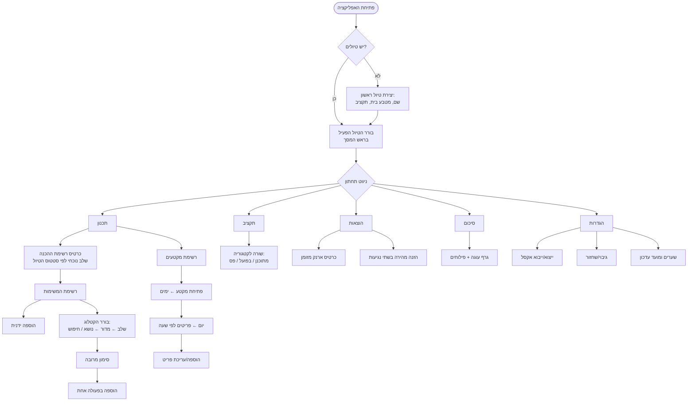
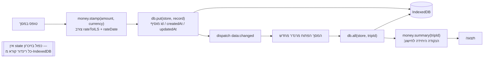
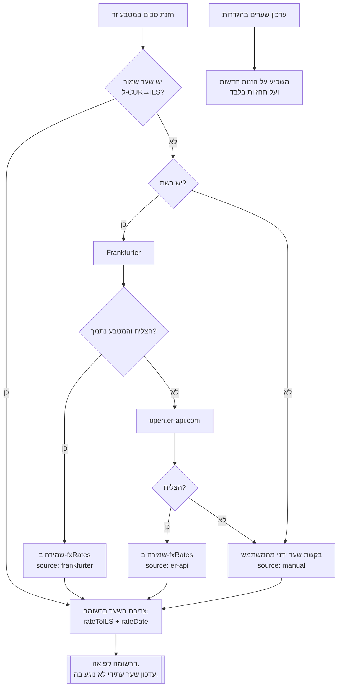
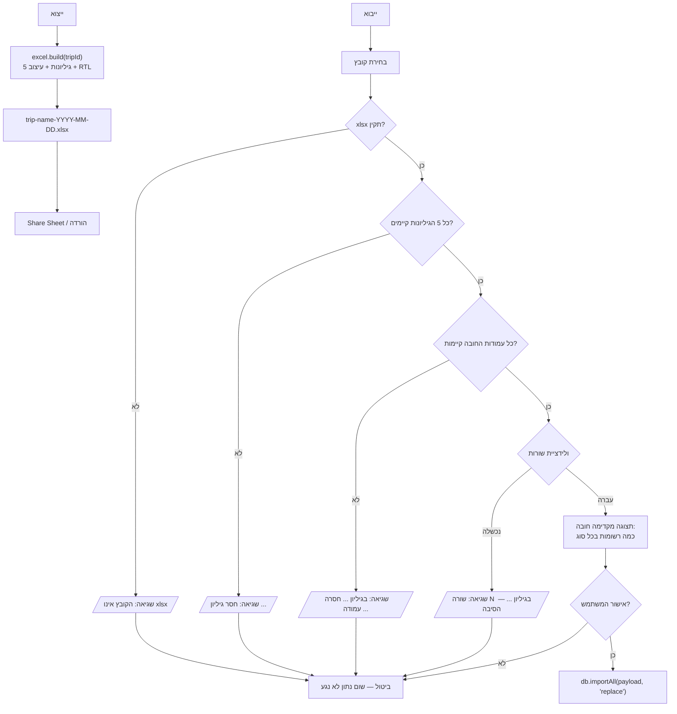
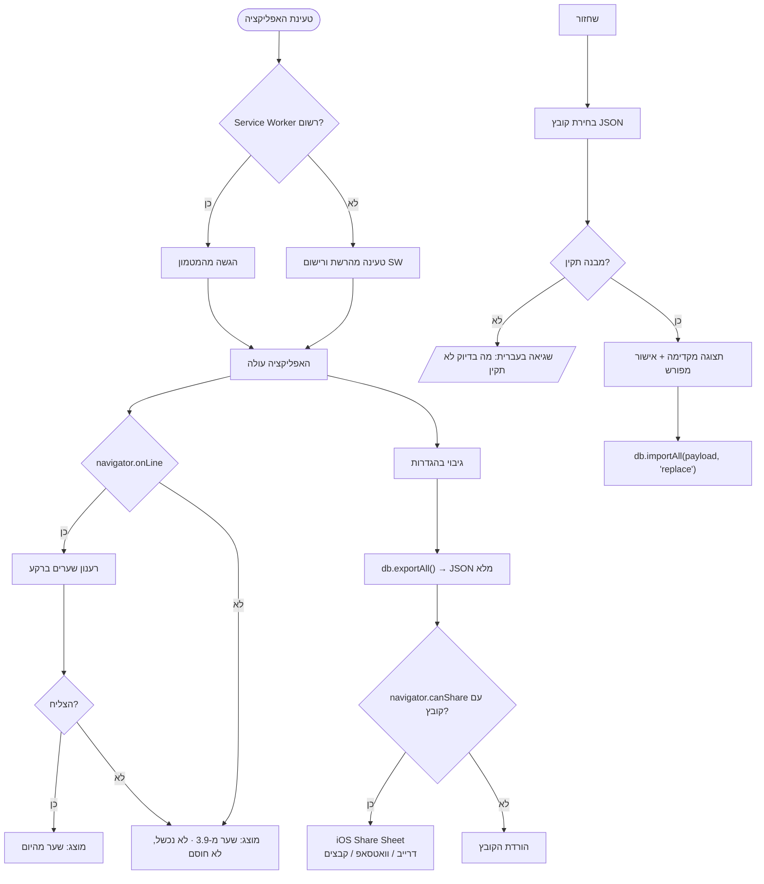
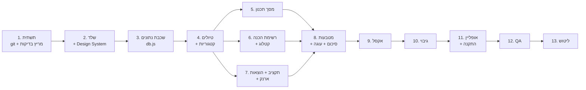

# תוכנית מימוש — "תכנון טיול ותקציב"

> **For agentic workers:** REQUIRED SUB-SKILL: Use superpowers:subagent-driven-development (recommended) or superpowers:executing-plans to implement this plan task-by-task. Steps use checkbox (`- [ ]`) syntax for tracking.

**Goal:** לבנות PWA בעברית שפועלת אופליין באייפון, לתכנון מסלול טיול, תקציב מראש, ומעקב הוצאות בפועל — כולל רשימת הכנה מקטלוג בן 519 פריטים, ייצוא/ייבוא אקסל, וגיבוי JSON.

**Architecture:** מודולי ES סטטיים בלי שלב build. IndexedDB הוא מקור האמת היחיד, ונגיש רק דרך `js/db.js`. כל חישוב כספי עובר דרך `js/money.js`. כתיבה לאחסון משדרת `data:changed`, והמסך הפתוח מרענן את עצמו — אין state כפול בזיכרון.

**Tech Stack:** HTML + CSS + Vanilla JS (ES modules) · Tailwind CDN + `css/tokens.css` · IndexedDB · Service Worker + manifest · SheetJS · Chart.js

**Spec:** [docs/superpowers/specs/2026-09-03-trip-planner-design.md](../specs/2026-09-03-trip-planner-design.md) · **Parent prompt:** [PROMPT.md](../../../PROMPT.md)

---

## Global Constraints

כל מה שכאן חל על **כל** משימה בתוכנית, גם אם לא נכתב שוב.

**עיצוב — ערכים מדויקים, אין להמציא חדשים:**
- צבעים: `--color-bg #FCFCFC` · `--color-surface #FFFFFF` · `--color-surface-2 #F2F4F6` · `--color-input #F5F7F8` · `--color-text #000000` · `--color-text-dim #5A6672` · `--color-accent #06BCC1` · `--color-highlight #EE4266` · `--color-border rgba(0,0,0,0.10)` · `--color-hairline rgba(0,0,0,0.06)`
- סטטוס בלבד: `--color-danger #D92D20` · `--color-success #0E9F6E` · `--color-warning #D97706`
- רדיוס: כרטיס `16px` · פקד/כפתור/שדה `12px`
- צל אחד בלבד: `shadow-stamp` = `0 1px 2px rgba(16,24,40,0.04), 0 6px 16px -4px rgba(16,24,40,0.08)`
- מרווחים: ריפוד כרטיס `p-4` · בין כרטיסים `mt-3` · צד מסך `px-4` · תחתית כל מסך `pb-36`
- כפתור ראשי `#EE4266` טקסט לבן `font-bold rounded-xl py-3` · משני `#06BCC1` לבן · שלישוני `bg-surface` + `border-line` טקסט שחור · הרסני טקסט וגבול `#D92D20` רקע שקוף
- אייקונים: SVG מתוך `ICONS` בלבד, `stroke="currentColor"`, `stroke-width="1.8"`. **אין אימוג'י בשום מקום בממשק.**
- צ'יפ נבחר: `bg-accent/10` + `border-accent` + `text-accent`
- שדות: רקע `--color-input`, מסגרת `--color-border`, `:focus { outline: 2px solid var(--color-accent) }`
- **כל ערך צבע/רדיוס/צל נכתב פעם אחת ב-`css/tokens.css`.** אסור hex בתוך JS או בתוך `class=` חוץ מהמיפוי ב-`tailwind.config` שב-`index.html`.

**פלטפורמה:**
- `dir="rtl"` · `lang="he"` · `safe-area-inset` למעלה ולמטה · אזור מגע 44px מינימום · שדות ב-`font-size: 16px` לפחות (למנוע zoom ב-iOS) · אין גלילה אופקית בשום מסך.

**קוד:**
- אין npm, אין build, אין framework. ספריות חיצוניות: **SheetJS + Chart.js בלבד**, נטענות מקומית מ-`vendor/` כדי שיעבדו אופליין.
- אין `alert()`, אין `confirm()`, אין `prompt()`. הודעות בממשק בלבד.
- אין מפתחות API בקוד. אין credentials.
- כל רשומה נושאת `id`, `createdAt`, `updatedAt`. כל רשומה תלוית-טיול נושאת גם `tripId`.
- כל סכום נשמר כ-`{ amount, currency, rateToILS, rateDate }`. **השער נצרב ברגע ההזנה ואינו משתנה לעולם.**
- מחיקת טיול וייבוא דורס דורשים אישור מפורש בממשק.

**החלטות שאושרו בסשן התכנון:**
- **git:** מאגר מקומי בלבד, בלי remote. קומיט בסוף כל משימה.
- **שערי מטבע:** Frankfurter ראשי (30 מטבעות, נתוני ECB), נפילה ל-`open.er-api.com` (166 מטבעות) כשהמטבע לא נתמך או השירות נפל. הממשק מציג מאיזה מקור הגיע השער.
- **גיבוי:** iOS Share Sheet בלבד (`navigator.share` עם קובץ, נפילה להורדה). **אין Google Drive API, אין OAuth.**
- **בדיקות:** `test.html` בדפדפן, המשתמש מריץ ומדווח. אין מריץ בדיקות אוטומטי.

**שפת עבודה:** מזהים בקוד באנגלית, טקסט ממשק בעברית, תגובות למשתמש בעברית.

---

## מבנה קבצים

| קובץ | אחריות | נוצר במשימה |
|---|---|---|
| `index.html` | שלד, `tailwind.config`, ניווט תחתון, mount point | 2 |
| `css/tokens.css` | **המקור היחיד** לצבעים, רדיוסים, צל, מרווחים | 2 |
| `css/app.css` | מחלקות רכיבים (`.card`, `.btn-*`, `.chip`, `.field`, `.icon-btn`, `.sheet`) | 2 |
| `js/icons.js` | `ICONS` — אובייקט SVG. קריאה בלבד | 2 |
| `js/ui.js` | עוזרי רינדור משותפים: `el`, `card`, `sheet`, `toast`, `confirm`, `fmtMoney`, `fmtDate` | 2 |
| `js/app.js` | ניתוב בין מסכים, הקשר הטיול הפעיל, האזנה ל-`data:changed` | 2 |
| `js/db.js` | IndexedDB + CRUD. **הנקודה היחידה שנוגעת באחסון** | 3 |
| `js/money.js` | המרות, שערים, `summary()`. **הנקודה היחידה שמחשבת כסף** | 4, 8 |
| `js/catalog.js` | טעינת `prep-catalog.json`, דפדוף וחיפוש | 6 |
| `js/screens/plan.js` | מסך תכנון: מקטעים, ימים, פריטים | 5 |
| `js/screens/prep.js` | כרטיס רשימת ההכנה + הרשימה + בורר הקטלוג | 6 |
| `js/screens/budget.js` | מסך תקציב | 7 |
| `js/screens/expenses.js` | מסך הוצאות + ארנק מזומן | 7 |
| `js/screens/summary.js` | מסך סיכום + גרף עוגה | 8 |
| `js/screens/settings.js` | הגדרות, שערים, אקסל, גיבוי, קטגוריות, מחיקה | 4, 9, 10 |
| `js/excel.js` | ייצוא וייבוא xlsx | 9 |
| `js/backup.js` | גיבוי ושחזור JSON דרך Share Sheet | 10 |
| `manifest.json` + `sw.js` | התקנה למסך הבית, מטמון אופליין | 11 |
| `icons/` | `icon-192.png`, `icon-512.png`, `apple-touch-icon.png` | 11 |
| `vendor/xlsx.full.min.js`, `vendor/chart.umd.js` | ספריות מקומיות לאופליין | 8, 9 |
| `test.html` + `tests/*.test.js` | מריץ הבדיקות בדפדפן | 1 |
| `data/prep-catalog.json` | הקטלוג. קריאה בלבד | קיים, מקבל `id` במשימה 1 |

**הערה על שני קבצים שאינם ברשימת האפיון ודורשים את אישורך:**
- `js/ui.js` — בלעדיו כל מסך יכתוב מחדש את אותם עוזרי רינדור, וזו הדרך הבטוחה ביותר שערכי עיצוב יזלגו לתוך קוד המסכים. **טעון אישור.**
- `js/screens/prep.js` — האפיון מגדיר "קובץ למסך", ורשימת ההכנה היא תת-מסך בתוך תכנון. היא גדולה מדי (רשימה + בורר קטלוג + 4 שלבים) כדי לשבת בתוך `plan.js`. **טעון אישור.**

---

## תרשים זרימה (תוצר שלב 2)

### מסלול המשתמש בין המסכים



### זרימת הנתונים: הזנה → אחסון → חישוב → תצוגה



### המרת מטבע — מתי נשמר שער



### ייצוא/ייבוא אקסל, כולל ענף הכישלון



### מקוון מול אופליין, וגיבוי



---

## סדר המשימות



---

### Task 1: תשתית — מאגר git, מריץ בדיקות, מזהים לקטלוג

**Files:**
- Create: `.gitignore`
- Create: `tests/harness.js`
- Create: `test.html`
- Create: `tests/catalog-ids.test.js`
- Modify: `data/prep-catalog.json` (הוספת שדה `id` לכל פריט)

**Interfaces:**
- Consumes: כלום. זו המשימה הראשונה.
- Produces:
  - `harness.js`: `export function suite(name)` → `{ test(label, fn), done() }` · `export function assertEqual(actual, expected, msg)` · `export function assertTrue(cond, msg)` · `export async function assertThrows(fn, msg)` · `export function assertClose(actual, expected, epsilon, msg)`
  - `data/prep-catalog.json`: כל פריט מקבל `id` בפורמט `"p0001"` … `"p0519"`, לפי סדר המערך הקיים. זהו ה-`catalogId` שהאפיון דורש.

- [ ] **Step 1: אימות זהות git ואיתחול המאגר**

```bash
cd "C:/Users/USER/PLAN A TRIP" && git init && git config user.name "itoosh-45" && git config user.email "mayaharrii@gmail.com" && git config user.name && git config user.email
```

צפוי: שתי השורות האחרונות מדפיסות `itoosh-45` ו-`mayaharrii@gmail.com`. אין remote — מאגר מקומי בלבד, לפי החלטת המשתמש.

- [ ] **Step 2: כתיבת `.gitignore`**

```
.DS_Store
Thumbs.db
*.log
scratch/
```

- [ ] **Step 3: הוספת מזהים לקטלוג**

הסקריפט מסרב לרוץ פעמיים, כדי שלא ידרוס מזהים קיימים:

```bash
cd "C:/Users/USER/PLAN A TRIP" && node -e "const fs=require('fs'),p='data/prep-catalog.json',c=JSON.parse(fs.readFileSync(p,'utf8')); if(c.some(x=>x.id)){console.error('FAIL: ids already present');process.exit(1);} c.forEach((x,i)=>x.id='p'+String(i+1).padStart(4,'0')); fs.writeFileSync(p,JSON.stringify(c,null,1)+'\n','utf8'); console.log('count',c.length,'first',c[0].id,'last',c[c.length-1].id);"
```

צפוי: `count 519 first p0001 last p0519`

- [ ] **Step 4: כתיבת מריץ הבדיקות `tests/harness.js`**

```js
// מריץ בדיקות מינימלי לדפדפן. אין תלות חיצונית.
const out = () => document.getElementById('results');

export function assertEqual(actual, expected, msg) {
  const a = JSON.stringify(actual), e = JSON.stringify(expected);
  if (a !== e) throw new Error(`${msg || 'assertEqual'}: קיבלנו ${a}, ציפינו ${e}`);
}

export function assertClose(actual, expected, epsilon, msg) {
  if (Math.abs(actual - expected) > epsilon)
    throw new Error(`${msg || 'assertClose'}: קיבלנו ${actual}, ציפינו ${expected} ±${epsilon}`);
}

export function assertTrue(cond, msg) {
  if (!cond) throw new Error(msg || 'assertTrue נכשל');
}

export async function assertThrows(fn, msg) {
  try { await fn(); } catch { return; }
  throw new Error(msg || 'assertThrows: לא נזרקה שגיאה');
}

export function suite(name) {
  const box = document.createElement('section');
  const h = document.createElement('h2');
  h.textContent = name;
  box.appendChild(h);
  out().appendChild(box);
  const queue = [];
  let pass = 0, fail = 0;

  return {
    test(label, fn) { queue.push([label, fn]); },
    async done() {
      for (const [label, fn] of queue) {
        const row = document.createElement('div');
        try {
          await fn();
          pass++;
          row.className = 'ok';
          row.textContent = `PASS · ${label}`;
        } catch (err) {
          fail++;
          row.className = 'bad';
          row.textContent = `FAIL · ${label} — ${err.message}`;
        }
        box.appendChild(row);
      }
      const sum = document.createElement('div');
      sum.className = fail ? 'bad total' : 'ok total';
      sum.textContent = `${name}: ${pass} עברו, ${fail} נכשלו`;
      box.appendChild(sum);
      window.__testTotals = window.__testTotals || { pass: 0, fail: 0 };
      window.__testTotals.pass += pass;
      window.__testTotals.fail += fail;
      return { pass, fail };
    }
  };
}
```

- [ ] **Step 5: כתיבת `test.html`**

```html
<!doctype html>
<html lang="he" dir="rtl">
<head>
<meta charset="utf-8">
<meta name="viewport" content="width=device-width, initial-scale=1">
<title>בדיקות — תכנון טיול ותקציב</title>
<style>
  body { font: 16px/1.6 -apple-system, system-ui, sans-serif; background:#FCFCFC; color:#000; margin:0; padding:16px 16px 80px; }
  h1 { font-size:20px; }
  section { background:#fff; border:1px solid rgba(0,0,0,.10); border-radius:16px; padding:16px; margin-top:12px; }
  h2 { font-size:16px; margin:0 0 8px; }
  .ok { color:#0E9F6E; }
  .bad { color:#D92D20; font-weight:700; }
  .total { margin-top:8px; padding-top:8px; border-top:1px solid rgba(0,0,0,.10); font-weight:700; }
  #grand { position:fixed; inset-block-end:0; inset-inline:0; padding:12px 16px; background:#fff; border-block-start:1px solid rgba(0,0,0,.10); font-weight:700; }
</style>
</head>
<body>
<h1>בדיקות — תכנון טיול ותקציב</h1>
<div id="results"></div>
<div id="grand">מריץ…</div>
<script type="module">
  // כל קובץ בדיקות מייצא default async שמריץ את עצמו.
  const modules = [
    './tests/catalog-ids.test.js',
  ];
  for (const m of modules) {
    try {
      const mod = await import(m);
      await mod.default();
    } catch (err) {
      const box = document.createElement('section');
      box.innerHTML = '<h2>שגיאת טעינה</h2>';
      const row = document.createElement('div');
      row.className = 'bad';
      row.textContent = `FAIL · ${m} — ${err.message}`;
      box.appendChild(row);
      document.getElementById('results').appendChild(box);
      window.__testTotals = window.__testTotals || { pass: 0, fail: 0 };
      window.__testTotals.fail++;
    }
  }
  const t = window.__testTotals || { pass: 0, fail: 0 };
  const g = document.getElementById('grand');
  g.textContent = `סה"כ: ${t.pass} עברו, ${t.fail} נכשלו`;
  g.style.color = t.fail ? '#D92D20' : '#0E9F6E';
</script>
</body>
</html>
```

> **הערה למבצע — חלה על כל משימה בהמשך:** כל קובץ בדיקות חדש חייב להתווסף למערך `modules` ב-`test.html`. זה הצעד היחיד שמחבר בדיקה חדשה למריץ, ושכחה שלו מסתירה בדיקות בשקט.

- [ ] **Step 6: כתיבת הבדיקה `tests/catalog-ids.test.js` והרצתה כדי לראות אותה נכשלת**

הבדיקה נכתבת לפני שלב 3 מבחינה לוגית — אם היא נכתבת אחרי, יש להריץ אותה על `git stash` של הקטלוג כדי לראות כישלון. הנוסח:

```js
import { suite, assertEqual } from './harness.js';

export default async function () {
  const s = suite('קטלוג ההכנה');
  const cat = await (await fetch('./data/prep-catalog.json')).json();

  s.test('הקטלוג מכיל 519 פריטים', () => {
    assertEqual(cat.length, 519);
  });

  s.test('לכל פריט יש id בפורמט pNNNN', () => {
    const bad = cat.filter(x => !/^p\d{4}$/.test(x.id || ''));
    assertEqual(bad.length, 0, `פריטים בלי id תקין: ${bad.length}`);
  });

  s.test('כל המזהים ייחודיים', () => {
    assertEqual(new Set(cat.map(x => x.id)).size, 519);
  });

  s.test('לכל פריט יש phase, section, topic, priority, text', () => {
    const bad = cat.filter(x => !x.phase || !x.section || !x.topic || !x.priority || !x.text);
    assertEqual(bad.length, 0);
  });

  s.test('התפלגות השלבים תואמת לאפיון', () => {
    const count = p => cat.filter(x => x.phase === p).length;
    assertEqual(
      { before: count('לפני'), onWay: count('בדרך'), during: count('בשהות'), back: count('בחזרה') },
      { before: 274, onWay: 45, during: 157, back: 43 }
    );
  });

  s.test('העדיפויות הן מתוך שלושת הערכים המותרים בלבד', () => {
    const allowed = new Set(['חובה', 'רלוונטי', 'נוחות']);
    assertEqual([...new Set(cat.map(x => x.priority))].filter(p => !allowed.has(p)), []);
  });

  s.test('8 מדורים ו-37 נושאים', () => {
    assertEqual(new Set(cat.map(x => x.section)).size, 8);
    assertEqual(new Set(cat.map(x => x.topic)).size, 37);
  });

  await s.done();
}
```

- [ ] **Step 7: הרצת הבדיקות — נקודת אישור של המשתמש**

`test.html` משתמש ב-`fetch` וב-ES modules, ולכן מחייב הגשה דרך HTTP. `file://` ייכשל. הפעלת שרת מקומי:

```bash
cd "C:/Users/USER/PLAN A TRIP" && python -m http.server 8080
```

המשתמש פותח `http://localhost:8080/test.html` ומדווח את שורת הסיכום התחתונה.

צפוי: **7 עברו, 0 נכשלו.**

אם `8 מדורים ו-37 נושאים` או התפלגות השלבים נכשלים — המספר באפיון הוא זה ששגוי, לא הקוד. יש לתקן את האפיון לערך האמיתי, לדווח למשתמש, ולא "לרכך" את הבדיקה.

- [ ] **Step 8: קומיט**

```bash
cd "C:/Users/USER/PLAN A TRIP" && git add .gitignore test.html tests/ data/prep-catalog.json && git commit -m "chore: init repo, browser test harness, catalog ids" -m "Co-Authored-By: Claude Opus 5 <noreply@anthropic.com>" && git log -1 --format="%an <%ae> · %s"
```

צפוי: `itoosh-45 <mayaharrii@gmail.com> · chore: init repo, browser test harness, catalog ids`

**נקודת אישור:** להציג למשתמש את מספר הבדיקות שעברו ואת שורת הקומיט, ולחכות לאישור לפני משימה 2.

---

### Task 2: שלד ומערכת העיצוב

**Files:**
- Create: `css/tokens.css`
- Create: `css/app.css`
- Create: `js/icons.js`
- Create: `js/ui.js`
- Create: `js/app.js`
- Create: `index.html`
- Create: `tests/ui.test.js`
- Modify: `test.html` (הוספת `./tests/ui.test.js` ל-`modules`)

**Interfaces:**
- Consumes: `tests/harness.js` (משימה 1)
- Produces:
  - `js/icons.js`: `export const ICONS = { plan, budget, expenses, summary, settings, plus, close, check, chevronDown, chevronLeft, edit, trash, flight, lodging, attraction, restaurant, transfer, ride, meeting, other, cash, card, share, download, refresh, search, alert }` — כל ערך הוא מחרוזת SVG פנימית (ללא תג `<svg>` עוטף).
  - `js/ui.js`: `export function icon(name, cls)` · `export function el(tag, attrs, children)` · `export function card(children, cls)` · `export function sheet({ title, body, actions })` → `{ close() }` · `export function toast(msg, kind)` · `export async function confirmDanger({ title, body, confirmLabel })` → `Promise<boolean>` · `export function fmtMoney(amount, currency)` · `export function fmtDate(iso)` · `export function fmtDateRange(fromIso, toIso)` · `export function nightsBetween(fromIso, toIso)` · `export function datesBetween(fromIso, toIso)` (מערך תאריכי ISO כולל שני הקצוות)
  - `js/app.js`: `export function registerScreen(key, mountFn)` · `export function navigate(key)` · `export function activeTripId()` · `export function setActiveTrip(id)` · `export function refresh()` · `export function boot()`

- [ ] **Step 1: כתיבת `css/tokens.css` — המקור היחיד לערכי העיצוב**

```css
:root {
  color-scheme: light;

  --color-bg: #FCFCFC;
  --color-surface: #FFFFFF;
  --color-surface-2: #F2F4F6;
  --color-input: #F5F7F8;
  --color-text: #000000;
  --color-text-dim: #5A6672;
  --color-accent: #06BCC1;
  --color-highlight: #EE4266;
  --color-border: rgba(0, 0, 0, 0.10);
  --color-hairline: rgba(0, 0, 0, 0.06);

  --color-danger: #D92D20;
  --color-success: #0E9F6E;
  --color-warning: #D97706;

  --radius-card: 16px;
  --radius-control: 12px;

  --shadow-stamp: 0 1px 2px rgba(16, 24, 40, 0.04), 0 6px 16px -4px rgba(16, 24, 40, 0.08);

  --space-screen-x: 16px;
  --space-card-p: 16px;
  --space-card-gap: 12px;
  --space-screen-bottom: 144px;

  --nav-height: 64px;
  --touch-min: 44px;
}
```

- [ ] **Step 2: כתיבת `css/app.css` — רכיבים בלבד, בלי ערכים חדשים**

כל צבע כאן הוא `var(--…)`. אין hex בקובץ הזה.

```css
* { -webkit-tap-highlight-color: transparent; }

html, body {
  margin: 0;
  background: var(--color-bg);
  color: var(--color-text);
  font-family: -apple-system, "SF Hebrew", system-ui, "Segoe UI", sans-serif;
  overflow-x: hidden;
}

body {
  padding-block-start: env(safe-area-inset-top);
}

#screen {
  padding-inline: var(--space-screen-x);
  padding-block-end: var(--space-screen-bottom);
}

.card {
  background: var(--color-surface);
  border: 1px solid var(--color-border);
  border-radius: var(--radius-card);
  box-shadow: var(--shadow-stamp);
  padding: var(--space-card-p);
}
.card + .card, .card-gap { margin-block-start: var(--space-card-gap); }

.btn {
  display: inline-flex;
  align-items: center;
  justify-content: center;
  gap: 8px;
  min-height: var(--touch-min);
  padding: 12px 16px;
  border-radius: var(--radius-control);
  border: 1px solid transparent;
  font-size: 16px;
  font-weight: 700;
  cursor: pointer;
}
.btn-primary   { background: var(--color-highlight); color: #fff; }
.btn-secondary { background: var(--color-accent);    color: #fff; }
.btn-tertiary  { background: var(--color-surface); color: var(--color-text); border-color: var(--color-border); }
.btn-danger    { background: transparent; color: var(--color-danger); border-color: var(--color-danger); }
.btn-block     { width: 100%; }

.icon-btn {
  display: inline-flex;
  align-items: center;
  justify-content: center;
  min-width: var(--touch-min);
  min-height: var(--touch-min);
  background: none;
  border: 0;
  color: var(--color-accent);
  cursor: pointer;
}

.field {
  width: 100%;
  box-sizing: border-box;
  min-height: var(--touch-min);
  padding: 12px;
  font-size: 16px;
  font-family: inherit;
  color: var(--color-text);
  background: var(--color-input);
  border: 1px solid var(--color-border);
  border-radius: var(--radius-control);
}
.field:focus { outline: 2px solid var(--color-accent); outline-offset: 0; }
.field-label { display: block; font-size: 14px; color: var(--color-text-dim); margin-block-end: 6px; }
.field-row { margin-block-start: 12px; }

.chip {
  display: inline-flex;
  align-items: center;
  min-height: 36px;
  padding: 6px 12px;
  border-radius: var(--radius-control);
  border: 1px solid var(--color-border);
  background: var(--color-surface);
  color: var(--color-text-dim);
  font-size: 14px;
  cursor: pointer;
}
.chip[aria-pressed="true"] {
  background: color-mix(in srgb, var(--color-accent) 10%, transparent);
  border-color: var(--color-accent);
  color: var(--color-accent);
}

.dim { color: var(--color-text-dim); }
.hairline { border-block-start: 1px solid var(--color-hairline); }
.num { font-variant-numeric: tabular-nums; direction: ltr; unicode-bidi: isolate; display: inline-block; }

.bar { height: 8px; border-radius: 999px; background: var(--color-hairline); overflow: hidden; }
.bar > span { display: block; height: 100%; background: var(--color-accent); }
.bar.warn > span   { background: var(--color-warning); }
.bar.over > span   { background: var(--color-danger); }

#nav {
  position: fixed;
  inset-inline: 0;
  inset-block-end: 0;
  display: grid;
  grid-template-columns: repeat(5, 1fr);
  background: var(--color-surface);
  border-block-start: 1px solid var(--color-border);
  padding-block-end: env(safe-area-inset-bottom);
  z-index: 20;
}
#nav button {
  display: flex;
  flex-direction: column;
  align-items: center;
  gap: 2px;
  min-height: var(--nav-height);
  padding: 8px 4px;
  background: none;
  border: 0;
  font-size: 11px;
  font-family: inherit;
  color: var(--color-text-dim);
  cursor: pointer;
}
#nav button[aria-current="page"] { color: var(--color-accent); font-weight: 700; }

.sheet-backdrop {
  position: fixed;
  inset: 0;
  background: rgba(0, 0, 0, 0.25);
  display: flex;
  align-items: flex-end;
  z-index: 40;
}
.sheet {
  width: 100%;
  max-height: 88vh;
  overflow-y: auto;
  background: var(--color-surface);
  border-start-start-radius: var(--radius-card);
  border-start-end-radius: var(--radius-card);
  padding: var(--space-card-p);
  padding-block-end: calc(var(--space-card-p) + env(safe-area-inset-bottom));
}
.sheet-head { display: flex; align-items: center; justify-content: space-between; margin-block-end: 12px; }
.sheet-title { font-size: 18px; font-weight: 700; margin: 0; }

#toasts {
  position: fixed;
  inset-inline: var(--space-screen-x);
  inset-block-end: calc(var(--nav-height) + 16px + env(safe-area-inset-bottom));
  z-index: 60;
  pointer-events: none;
}
.toast {
  margin-block-start: 8px;
  padding: 12px 16px;
  border-radius: var(--radius-control);
  background: var(--color-surface);
  border: 1px solid var(--color-border);
  box-shadow: var(--shadow-stamp);
  font-size: 14px;
}
.toast.error   { color: var(--color-danger);  border-color: var(--color-danger); }
.toast.success { color: var(--color-success); border-color: var(--color-success); }
.toast.warning { color: var(--color-warning); border-color: var(--color-warning); }

.fab {
  position: fixed;
  inset-inline-start: var(--space-screen-x);
  inset-block-end: calc(var(--nav-height) + 16px + env(safe-area-inset-bottom));
  z-index: 30;
  box-shadow: var(--shadow-stamp);
}

@media (prefers-reduced-motion: no-preference) {
  .sheet { animation: sheet-in 200ms ease-out; }
  @keyframes sheet-in { from { transform: translateY(12px); opacity: 0; } }
}
```

- [ ] **Step 3: כתיבת `js/icons.js`**

כל ערך הוא התוכן הפנימי של ה-SVG. העוטף נבנה ב-`ui.icon()` עם `stroke="currentColor"` ו-`stroke-width="1.8"`.

```js
export const ICONS = {
  plan:        '<path d="M8 2v3M16 2v3M3 9h18M5 5h14a2 2 0 0 1 2 2v12a2 2 0 0 1-2 2H5a2 2 0 0 1-2-2V7a2 2 0 0 1 2-2Z"/>',
  budget:      '<path d="M3 7h18v12a2 2 0 0 1-2 2H5a2 2 0 0 1-2-2V7Z"/><path d="M16 7V5a2 2 0 0 0-2-2h-4a2 2 0 0 0-2 2v2"/><path d="M12 12v4M10 14h4"/>',
  expenses:    '<path d="M4 6h16a1 1 0 0 1 1 1v10a1 1 0 0 1-1 1H4a1 1 0 0 1-1-1V7a1 1 0 0 1 1-1Z"/><path d="M3 10h18"/><path d="M7 14h3"/>',
  summary:     '<path d="M12 3a9 9 0 1 0 9 9h-9V3Z"/><path d="M12 3a9 9 0 0 1 9 9"/>',
  settings:    '<circle cx="12" cy="12" r="3"/><path d="M12 2v3M12 19v3M2 12h3M19 12h3M5 5l2 2M17 17l2 2M19 5l-2 2M7 17l-2 2"/>',
  plus:        '<path d="M12 5v14M5 12h14"/>',
  close:       '<path d="M6 6l12 12M18 6L6 18"/>',
  check:       '<path d="M4 12l5 5L20 6"/>',
  chevronDown: '<path d="M6 9l6 6 6-6"/>',
  chevronLeft: '<path d="M15 6l-6 6 6 6"/>',
  edit:        '<path d="M4 20h4l10-10-4-4L4 16v4Z"/><path d="M13 5l4 4"/>',
  trash:       '<path d="M4 7h16"/><path d="M9 7V5a1 1 0 0 1 1-1h4a1 1 0 0 1 1 1v2"/><path d="M6 7l1 13a1 1 0 0 0 1 1h8a1 1 0 0 0 1-1l1-13"/>',
  flight:      '<path d="M3 13l18-6-6 15-3-6-6-3Z"/>',
  lodging:     '<path d="M3 20V8l9-5 9 5v12"/><path d="M9 20v-6h6v6"/>',
  attraction:  '<path d="M12 3l2.6 5.6 6.1.8-4.4 4.3 1.1 6.1L12 17l-5.4 2.8 1.1-6.1L3.3 9.4l6.1-.8L12 3Z"/>',
  restaurant:  '<path d="M6 3v8a2 2 0 0 0 4 0V3"/><path d="M8 11v10"/><path d="M16 3c-1.5 2-2 3.5-2 6s.5 4 2 4 2-1.5 2-4-.5-4-2-6Z"/><path d="M16 13v8"/>',
  transfer:    '<path d="M4 8h13l-3-3M20 16H7l3 3"/>',
  ride:        '<path d="M5 17h14"/><path d="M6 17V9l2-4h8l2 4v8"/><circle cx="8" cy="17" r="2"/><circle cx="16" cy="17" r="2"/>',
  meeting:     '<circle cx="9" cy="8" r="3"/><path d="M3 20c0-3 2.7-5 6-5s6 2 6 5"/><path d="M16 6a3 3 0 0 1 0 6"/><path d="M18 20c0-2-.8-3.5-2-4.4"/>',
  other:       '<circle cx="12" cy="12" r="9"/><path d="M12 8v.5M12 11v5"/>',
  cash:        '<path d="M3 7h18v10H3z"/><circle cx="12" cy="12" r="2.5"/>',
  card:        '<path d="M3 6h18v12H3z"/><path d="M3 10h18"/>',
  share:       '<path d="M12 16V4"/><path d="M8 8l4-4 4 4"/><path d="M5 14v5a1 1 0 0 0 1 1h12a1 1 0 0 0 1-1v-5"/>',
  download:    '<path d="M12 4v12"/><path d="M8 12l4 4 4-4"/><path d="M5 20h14"/>',
  refresh:     '<path d="M20 12a8 8 0 1 1-2.3-5.7"/><path d="M20 4v5h-5"/>',
  search:      '<circle cx="11" cy="11" r="7"/><path d="M16 16l5 5"/>',
  alert:       '<path d="M12 4l9 16H3L12 4Z"/><path d="M12 10v4M12 17v.5"/>',
};
```

- [ ] **Step 4: כתיבת `js/ui.js`**

```js
import { ICONS } from './icons.js';

export function icon(name, cls = '') {
  const body = ICONS[name] || ICONS.other;
  return `<svg viewBox="0 0 24 24" width="20" height="20" fill="none"
    stroke="currentColor" stroke-width="1.8" stroke-linecap="round"
    stroke-linejoin="round" aria-hidden="true" class="${cls}">${body}</svg>`;
}

export function el(tag, attrs = {}, children = []) {
  const node = document.createElement(tag);
  for (const [k, v] of Object.entries(attrs)) {
    if (v === null || v === undefined || v === false) continue;
    if (k === 'class') node.className = v;
    else if (k === 'html') node.innerHTML = v;
    else if (k === 'text') node.textContent = v;
    else if (k.startsWith('on')) node.addEventListener(k.slice(2).toLowerCase(), v);
    else node.setAttribute(k, v);
  }
  for (const c of [].concat(children)) {
    if (c === null || c === undefined || c === false) continue;
    node.append(typeof c === 'string' ? document.createTextNode(c) : c);
  }
  return node;
}

export function card(children, cls = '') {
  return el('div', { class: `card ${cls}`.trim() }, children);
}

export function sheet({ title, body, actions = [] }) {
  const backdrop = el('div', { class: 'sheet-backdrop' });
  const close = () => backdrop.remove();

  const panel = el('div', { class: 'sheet', role: 'dialog', 'aria-modal': 'true', 'aria-label': title }, [
    el('div', { class: 'sheet-head' }, [
      el('h2', { class: 'sheet-title', text: title }),
      el('button', { class: 'icon-btn', 'aria-label': 'סגור', html: icon('close'), onClick: close }),
    ]),
    body,
    actions.length
      ? el('div', { class: 'field-row', style: 'display:flex; gap:8px' }, actions)
      : null,
  ]);

  backdrop.append(panel);
  backdrop.addEventListener('click', e => { if (e.target === backdrop) close(); });
  document.body.append(backdrop);
  return { close, panel };
}

export function toast(msg, kind = '') {
  const host = document.getElementById('toasts');
  const node = el('div', { class: `toast ${kind}`.trim(), text: msg, role: 'status' });
  host.append(node);
  setTimeout(() => node.remove(), 3500);
}

export function confirmDanger({ title, body, confirmLabel = 'מחק' }) {
  return new Promise(resolve => {
    let settled = false;
    const finish = v => { if (!settled) { settled = true; s.close(); resolve(v); } };
    const s = sheet({
      title,
      body: el('p', { class: 'dim', text: body }),
      actions: [
        el('button', { class: 'btn btn-tertiary btn-block', text: 'ביטול', onClick: () => finish(false) }),
        el('button', { class: 'btn btn-danger btn-block', text: confirmLabel, onClick: () => finish(true) }),
      ],
    });
  });
}

const MONEY = new Map();
export function fmtMoney(amount, currency = 'ILS') {
  if (amount === null || amount === undefined || Number.isNaN(amount)) return '—';
  if (!MONEY.has(currency)) {
    MONEY.set(currency, new Intl.NumberFormat('he-IL', {
      style: 'currency', currency, maximumFractionDigits: 2, minimumFractionDigits: 0,
    }));
  }
  return MONEY.get(currency).format(amount);
}

export function fmtDate(iso) {
  if (!iso) return '';
  const [y, m, d] = iso.split('-').map(Number);
  return new Intl.DateTimeFormat('he-IL', { day: 'numeric', month: 'short' })
    .format(new Date(Date.UTC(y, m - 1, d)));
}

export function fmtDateRange(fromIso, toIso) {
  if (!fromIso) return '';
  if (!toIso || fromIso === toIso) return fmtDate(fromIso);
  return `${fmtDate(fromIso)} – ${fmtDate(toIso)}`;
}

export function nightsBetween(fromIso, toIso) {
  if (!fromIso || !toIso) return 0;
  const a = Date.parse(`${fromIso}T00:00:00Z`);
  const b = Date.parse(`${toIso}T00:00:00Z`);
  return Math.max(0, Math.round((b - a) / 86400000));
}

export function datesBetween(fromIso, toIso) {
  const out = [];
  if (!fromIso || !toIso) return out;
  let t = Date.parse(`${fromIso}T00:00:00Z`);
  const end = Date.parse(`${toIso}T00:00:00Z`);
  while (t <= end) {
    out.push(new Date(t).toISOString().slice(0, 10));
    t += 86400000;
  }
  return out;
}
```

- [ ] **Step 5: כתיבת `js/app.js`**

```js
import { el, icon, toast } from './ui.js';

const SCREENS = [
  { key: 'plan',     label: 'תכנון',   iconName: 'plan' },
  { key: 'budget',   label: 'תקציב',   iconName: 'budget' },
  { key: 'expenses', label: 'הוצאות',  iconName: 'expenses' },
  { key: 'summary',  label: 'סיכום',   iconName: 'summary' },
  { key: 'settings', label: 'הגדרות',  iconName: 'settings' },
];

const mounts = new Map();
let current = 'plan';
let activeTrip = null;

export function registerScreen(key, mountFn) { mounts.set(key, mountFn); }
export function activeTripId() { return activeTrip; }

export function setActiveTrip(id) {
  activeTrip = id;
  try { localStorage.setItem('activeTripId', id ?? ''); } catch { /* מצב פרטי */ }
  refresh();
}

export function navigate(key) {
  current = key;
  for (const b of document.querySelectorAll('#nav button')) {
    b.setAttribute('aria-current', b.dataset.key === key ? 'page' : 'false');
  }
  refresh();
}

export async function refresh() {
  const host = document.getElementById('screen');
  const mount = mounts.get(current);
  host.replaceChildren();
  if (!mount) {
    host.append(el('div', { class: 'card card-gap dim', text: 'המסך הזה עוד לא נבנה.' }));
    return;
  }
  try {
    await mount(host, activeTrip);
  } catch (err) {
    host.append(el('div', { class: 'card card-gap' }, [
      el('div', { class: 'toast error', text: `שגיאה בטעינת המסך: ${err.message}` }),
    ]));
  }
  host.scrollIntoView({ block: 'start' });
}

function buildNav() {
  const nav = document.getElementById('nav');
  nav.replaceChildren(...SCREENS.map(s =>
    el('button', {
      'data-key': s.key,
      'aria-current': s.key === current ? 'page' : 'false',
      onClick: () => navigate(s.key),
    }, [
      el('span', { html: icon(s.iconName) }),
      el('span', { text: s.label }),
    ])
  ));
}

export async function boot() {
  buildNav();
  try { activeTrip = localStorage.getItem('activeTripId') || null; } catch { activeTrip = null; }
  document.addEventListener('data:changed', () => refresh());
  window.addEventListener('online',  () => toast('חזרנו לרשת', 'success'));
  window.addEventListener('offline', () => toast('אין רשת. האפליקציה ממשיכה לעבוד.', 'warning'));
  await refresh();
}
```

- [ ] **Step 6: כתיבת `index.html`**

Tailwind נטען מ-CDN לפי ה-Stack המאושר, אך **כל ערך עיצוב נשאב מ-`tokens.css`** דרך `tailwind.config`. שימו לב: CDN לא יעבוד אופליין — במשימה 11 הוא מוחלף בקובץ מקומי ב-`vendor/`.

```html
<!doctype html>
<html lang="he" dir="rtl">
<head>
<meta charset="utf-8">
<meta name="viewport" content="width=device-width, initial-scale=1, viewport-fit=cover, maximum-scale=1">
<meta name="apple-mobile-web-app-capable" content="yes">
<meta name="apple-mobile-web-app-status-bar-style" content="default">
<meta name="apple-mobile-web-app-title" content="טיול ותקציב">
<meta name="theme-color" content="#FCFCFC">
<title>תכנון טיול ותקציב</title>
<link rel="stylesheet" href="./css/tokens.css">
<link rel="stylesheet" href="./css/app.css">
<script src="https://cdn.tailwindcss.com"></script>
<script>
  tailwind.config = {
    theme: {
      extend: {
        colors: {
          bg: 'var(--color-bg)',
          surface: 'var(--color-surface)',
          'surface-2': 'var(--color-surface-2)',
          input: 'var(--color-input)',
          text: 'var(--color-text)',
          'text-dim': 'var(--color-text-dim)',
          accent: 'var(--color-accent)',
          highlight: 'var(--color-highlight)',
          line: 'var(--color-border)',
          hairline: 'var(--color-hairline)',
          danger: 'var(--color-danger)',
          success: 'var(--color-success)',
          warning: 'var(--color-warning)',
        },
        borderRadius: { card: 'var(--radius-card)', xl: 'var(--radius-control)' },
        boxShadow: { stamp: 'var(--shadow-stamp)' },
      },
    },
  };
</script>
</head>
<body>
<header id="topbar"></header>
<main id="screen"></main>
<div id="toasts"></div>
<nav id="nav" aria-label="ניווט ראשי"></nav>

<script type="module">
  import { boot } from './js/app.js';
  await boot();
</script>
</body>
</html>
```

- [ ] **Step 7: כתיבת הבדיקה `tests/ui.test.js`**

```js
import { suite, assertEqual, assertTrue } from './harness.js';
import { ICONS } from '../js/icons.js';
import { icon, el, fmtDate, fmtDateRange, nightsBetween, datesBetween } from '../js/ui.js';

export default async function () {
  const s = suite('מערכת העיצוב ועוזרי הממשק');

  s.test('כל האייקונים הנדרשים קיימים', () => {
    const need = ['plan','budget','expenses','summary','settings','plus','close','check',
      'chevronDown','chevronLeft','edit','trash','flight','lodging','attraction','restaurant',
      'transfer','ride','meeting','other','cash','card','share','download','refresh','search','alert'];
    assertEqual(need.filter(n => !ICONS[n]), []);
  });

  s.test('אין אימוג׳י בשום אייקון', () => {
    const emoji = /\p{Extended_Pictographic}/u;
    assertEqual(Object.keys(ICONS).filter(k => emoji.test(ICONS[k])), []);
  });

  s.test('כל אייקון בנוי מ-path/circle/rect בלבד', () => {
    const bad = Object.entries(ICONS).filter(([, v]) => !/^<(path|circle|rect|line|polyline)\b/.test(v));
    assertEqual(bad.map(([k]) => k), []);
  });

  s.test('icon() מפיק svg עם currentColor ו-stroke-width 1.8', () => {
    const svg = icon('plan');
    assertTrue(svg.includes('stroke="currentColor"'), 'חסר currentColor');
    assertTrue(svg.includes('stroke-width="1.8"'), 'עובי קו שגוי');
    assertTrue(svg.includes('fill="none"'), 'חסר fill=none');
  });

  s.test('icon() בשם לא מוכר נופל ל-other ולא קורס', () => {
    assertTrue(icon('no-such-icon').includes('<svg'), 'לא הוחזר svg');
  });

  s.test('el() מגדיר class, text ומאזין לאירוע', () => {
    let clicked = 0;
    const node = el('button', { class: 'btn', text: 'שלח', onClick: () => clicked++ });
    node.dispatchEvent(new Event('click'));
    assertEqual([node.tagName, node.className, node.textContent, clicked], ['BUTTON', 'btn', 'שלח', 1]);
  });

  s.test('nightsBetween מחשב לילות נכון', () => {
    assertEqual(nightsBetween('2026-09-01', '2026-09-04'), 3);
    assertEqual(nightsBetween('2026-09-01', '2026-09-01'), 0);
    assertEqual(nightsBetween('2026-09-01', null), 0);
  });

  s.test('datesBetween כולל את שני הקצוות וחוצה חודש', () => {
    assertEqual(datesBetween('2026-08-30', '2026-09-02'),
      ['2026-08-30', '2026-08-31', '2026-09-01', '2026-09-02']);
    assertEqual(datesBetween('2026-09-01', '2026-09-01'), ['2026-09-01']);
  });

  s.test('datesBetween חוצה שנה', () => {
    assertEqual(datesBetween('2026-12-30', '2027-01-02'),
      ['2026-12-30', '2026-12-31', '2027-01-01', '2027-01-02']);
  });

  s.test('fmtDate ו-fmtDateRange מחזירים טקסט ולא קורסים על ריק', () => {
    assertTrue(fmtDate('2026-09-03').length > 0);
    assertEqual(fmtDate(''), '');
    assertEqual(fmtDateRange('2026-09-03', '2026-09-03'), fmtDate('2026-09-03'));
    assertEqual(fmtDateRange('', ''), '');
  });

  s.test('tokens.css הוא המקור לצבעים — הערכים נטענו', () => {
    const v = n => getComputedStyle(document.documentElement).getPropertyValue(n).trim();
    assertEqual(v('--color-highlight'), '#EE4266');
    assertEqual(v('--color-accent'), '#06BCC1');
    assertEqual(v('--color-danger'), '#D92D20');
    assertEqual(v('--radius-card'), '16px');
  });

  await s.done();
}
```

- [ ] **Step 8: חיבור הבדיקה למריץ**

ב-`test.html`, להוסיף למערך `modules` את `'./tests/ui.test.js'`, ולטעון את גיליונות הסגנון כדי שהבדיקה האחרונה תוכל לקרוא את הטוקנים. בתוך `<head>` של `test.html`:

```html
<link rel="stylesheet" href="./css/tokens.css">
```

- [ ] **Step 9: הרצת הבדיקות**

המשתמש טוען מחדש `http://localhost:8080/test.html`.
צפוי: **7 + 12 = 19 עברו, 0 נכשלו.**

- [ ] **Step 10: בדיקה ויזואלית — נקודת אישור של המשתמש**

המשתמש פותח `http://localhost:8080/index.html` בדפדפן, ואם אפשר גם ב-Safari באייפון.
צפוי לראות:
1. ניווט תחתון עם 5 לשוניות ואייקוני SVG, "תכנון" מודגש ב-`#06BCC1`.
2. הודעה "המסך הזה עוד לא נבנה" בטקסט משני — כי אף מסך לא נרשם עדיין.
3. רקע `#FCFCFC`, בלי גלילה אופקית, בלי שורת כתובת שמכסה תוכן.
4. במצב לרוחב — הניווט נשאר למטה והתוכן לא נחתך.

**עצור כאן והצג למשתמש צילום מסך לאישור העיצוב לפני שממשיכים.** האפיון מחייב אישור על כל החלטת עיצוב, וזו הפעם הראשונה שהוא רואה את המערכת בפועל.

- [ ] **Step 11: קומיט**

```bash
cd "C:/Users/USER/PLAN A TRIP" && git add index.html css/ js/ test.html tests/ && git commit -m "feat: app shell, design tokens, icons, ui helpers" -m "Co-Authored-By: Claude Opus 5 <noreply@anthropic.com>"
```

---

### Task 3: שכבת הנתונים — `js/db.js`

**Files:**
- Create: `js/db.js`
- Create: `tests/db.test.js`
- Modify: `test.html` (הוספת `./tests/db.test.js`)

**Interfaces:**
- Consumes: `tests/harness.js`
- Produces — ה-API היחיד שדרכו האפליקציה נוגעת באחסון:
  - `export const DB_NAME = 'trip-planner'` · `export const DB_VERSION = 1`
  - `export const STORES = { trips:'trips', segments:'segments', items:'items', expenses:'expenses', wallets:'wallets', walletTx:'walletTx', prepTasks:'prepTasks', categories:'categories', budgets:'budgets', fxRates:'fxRates', settings:'settings' }`
  - `export async function open(): Promise<IDBDatabase>`
  - `export async function put(store, record): Promise<record>` — מייצר `id` אם חסר, קובע `createdAt` פעם אחת ו-`updatedAt` בכל כתיבה, מוסיף `tripId` אם ה-store דורש אותו, ומשדר `data:changed`
  - `export async function bulkPut(store, records): Promise<records>` — טרנזקציה אחת, אירוע אחד בסוף
  - `export async function get(store, id): Promise<record|undefined>`
  - `export async function all(store, tripId?): Promise<record[]>` — עם `tripId` מסנן דרך האינדקס; בלעדיו מחזיר הכול
  - `export async function remove(store, id): Promise<void>`
  - `export async function removeWhere(store, tripId): Promise<number>`
  - `export async function deleteTrip(tripId): Promise<void>` — מוחק את הטיול וכל מה שתלוי בו, בטרנזקציה אחת
  - `export async function getSetting(key, fallback): Promise<any>` · `export async function setSetting(key, value): Promise<void>`
  - `export async function exportAll(): Promise<{schema:number, exportedAt:string, stores:Object}>`
  - `export async function importAll(payload, mode): Promise<{counts:Object}>` — `mode` הוא `'replace'` או `'merge'`; זורק `Error` בעברית על מבנה פסול, **לפני** שנגע בנתון אחד
  - `export async function wipe(): Promise<void>`
  - `export const TRIP_SCOPED = ['segments','items','expenses','wallets','walletTx','prepTasks','categories','budgets']`

**מבנה ה-object stores:**

| store | keyPath | אינדקסים |
|---|---|---|
| `trips` | `id` | — |
| `segments` | `id` | `tripId`, `startDate` |
| `items` | `id` | `tripId`, `date`, `segmentId` |
| `expenses` | `id` | `tripId`, `date` |
| `wallets` | `id` | `tripId`, `currency` |
| `walletTx` | `id` | `tripId`, `walletId` |
| `prepTasks` | `id` | `tripId`, `phase`, `catalogId` |
| `categories` | `id` | `tripId` |
| `budgets` | `id` | `tripId`, `categoryId` |
| `fxRates` | `pair` | — |
| `settings` | `key` | — |

`fxRates` ו-`settings` הם היחידים שאינם תלויי טיול — שערים ומטבע בית משותפים לכל הטיולים.

- [ ] **Step 1: כתיבת הבדיקה הנכשלת `tests/db.test.js`**

הבדיקות רצות על מסד נפרד (`trip-planner-test`) ומנקות אחרי עצמן, כדי שהרצת בדיקות לא תמחק נתוני אמת.

```js
import { suite, assertEqual, assertTrue, assertThrows } from './harness.js';
import * as db from '../js/db.js';

export default async function () {
  const s = suite('שכבת הנתונים');

  await db.useTestDatabase();   // עובר למסד 'trip-planner-test'
  await db.wipe();

  s.test('put מייצר id, createdAt ו-updatedAt', async () => {
    const t = await db.put(db.STORES.trips, { name: 'יפן', homeCurrency: 'ILS' });
    assertTrue(!!t.id, 'לא נוצר id');
    assertTrue(!!t.createdAt, 'לא נוצר createdAt');
    assertEqual(t.createdAt, t.updatedAt, 'ברשומה חדשה שני החותמים זהים');
  });

  s.test('put חוזר על אותה רשומה שומר createdAt ומקדם updatedAt', async () => {
    const t = await db.put(db.STORES.trips, { name: 'גאורגיה', homeCurrency: 'ILS' });
    await new Promise(r => setTimeout(r, 5));
    const t2 = await db.put(db.STORES.trips, { ...t, name: 'גאורגיה 2026' });
    assertEqual(t2.createdAt, t.createdAt, 'createdAt השתנה');
    assertTrue(t2.updatedAt > t.updatedAt, 'updatedAt לא התקדם');
    assertEqual(t2.id, t.id, 'ה-id השתנה');
  });

  s.test('get מחזיר undefined על id שאינו קיים', async () => {
    assertEqual(await db.get(db.STORES.trips, 'no-such-id'), undefined);
  });

  s.test('all עם tripId מסנן, ושני טיולים לא דולפים זה לזה', async () => {
    await db.wipe();
    const a = await db.put(db.STORES.trips, { name: 'טיול א', homeCurrency: 'ILS' });
    const b = await db.put(db.STORES.trips, { name: 'טיול ב', homeCurrency: 'ILS' });
    await db.put(db.STORES.segments, { tripId: a.id, city: 'טוקיו', startDate: '2026-10-01', endDate: '2026-10-05', currency: 'JPY' });
    await db.put(db.STORES.segments, { tripId: a.id, city: 'קיוטו', startDate: '2026-10-05', endDate: '2026-10-08', currency: 'JPY' });
    await db.put(db.STORES.segments, { tripId: b.id, city: 'תביליסי', startDate: '2026-11-01', endDate: '2026-11-04', currency: 'GEL' });

    assertEqual((await db.all(db.STORES.segments, a.id)).length, 2);
    assertEqual((await db.all(db.STORES.segments, b.id)).length, 1);
    assertEqual((await db.all(db.STORES.segments)).length, 3);
  });

  s.test('put ל-store תלוי-טיול בלי tripId נכשל בעברית', async () => {
    await assertThrows(
      () => db.put(db.STORES.segments, { city: 'בלי טיול', startDate: '2026-01-01' }),
      'רשומה בלי tripId נשמרה'
    );
  });

  s.test('remove מוחק רשומה אחת בלבד', async () => {
    await db.wipe();
    const t = await db.put(db.STORES.trips, { name: 'ט', homeCurrency: 'ILS' });
    const e1 = await db.put(db.STORES.expenses, { tripId: t.id, amount: 10, currency: 'ILS', date: '2026-09-01' });
    await db.put(db.STORES.expenses, { tripId: t.id, amount: 20, currency: 'ILS', date: '2026-09-02' });
    await db.remove(db.STORES.expenses, e1.id);
    const left = await db.all(db.STORES.expenses, t.id);
    assertEqual([left.length, left[0].amount], [1, 20]);
  });

  s.test('deleteTrip מוחק את הטיול וכל התלויים בו, ולא נוגע בטיול השני', async () => {
    await db.wipe();
    const a = await db.put(db.STORES.trips, { name: 'א', homeCurrency: 'ILS' });
    const b = await db.put(db.STORES.trips, { name: 'ב', homeCurrency: 'ILS' });
    for (const tripId of [a.id, b.id]) {
      await db.put(db.STORES.segments, { tripId, city: 'עיר', startDate: '2026-01-01', endDate: '2026-01-03', currency: 'EUR' });
      await db.put(db.STORES.items, { tripId, type: 'flight', title: 'טיסה', date: '2026-01-01' });
      await db.put(db.STORES.expenses, { tripId, amount: 5, currency: 'EUR', date: '2026-01-02' });
      await db.put(db.STORES.prepTasks, { tripId, title: 'דרכון', phase: 'לפני', done: false });
    }
    await db.deleteTrip(a.id);

    assertEqual(await db.get(db.STORES.trips, a.id), undefined, 'הטיול לא נמחק');
    for (const st of ['segments', 'items', 'expenses', 'prepTasks']) {
      assertEqual((await db.all(db.STORES[st], a.id)).length, 0, `נשארו רשומות ב-${st}`);
      assertEqual((await db.all(db.STORES[st], b.id)).length, 1, `נפגעו רשומות של הטיול השני ב-${st}`);
    }
    assertTrue(!!(await db.get(db.STORES.trips, b.id)), 'הטיול השני נמחק');
  });

  s.test('data:changed משודר בכל כתיבה ובכל מחיקה', async () => {
    await db.wipe();
    let count = 0;
    const onChange = () => count++;
    document.addEventListener('data:changed', onChange);
    const t = await db.put(db.STORES.trips, { name: 'אירוע', homeCurrency: 'ILS' });
    await db.remove(db.STORES.trips, t.id);
    document.removeEventListener('data:changed', onChange);
    assertEqual(count, 2);
  });

  s.test('bulkPut שומר את כל הרשומות ומשדר אירוע אחד', async () => {
    await db.wipe();
    const t = await db.put(db.STORES.trips, { name: 'המוני', homeCurrency: 'ILS' });
    let events = 0;
    const onChange = () => events++;
    document.addEventListener('data:changed', onChange);
    const rows = Array.from({ length: 50 }, (_, i) => ({
      tripId: t.id, title: `משימה ${i}`, phase: 'לפני', done: false,
    }));
    const saved = await db.bulkPut(db.STORES.prepTasks, rows);
    document.removeEventListener('data:changed', onChange);
    assertEqual(saved.length, 50);
    assertEqual((await db.all(db.STORES.prepTasks, t.id)).length, 50);
    assertEqual(events, 1, 'bulkPut שידר יותר מאירוע אחד');
  });

  s.test('settings נשמרות ונקראות עם ברירת מחדל', async () => {
    assertEqual(await db.getSetting('homeCurrency', 'ILS'), 'ILS');
    await db.setSetting('homeCurrency', 'ILS');
    await db.setSetting('fxSource', 'frankfurter');
    assertEqual(await db.getSetting('fxSource', null), 'frankfurter');
    assertEqual(await db.getSetting('noSuchKey', 'ברירת מחדל'), 'ברירת מחדל');
  });

  s.test('exportAll מחזיר את כל ה-stores עם גרסת סכימה', async () => {
    await db.wipe();
    const t = await db.put(db.STORES.trips, { name: 'ייצוא', homeCurrency: 'ILS' });
    await db.put(db.STORES.expenses, { tripId: t.id, amount: 99, currency: 'ILS', date: '2026-09-03' });
    const dump = await db.exportAll();
    assertEqual(dump.schema, db.DB_VERSION);
    assertTrue(!!dump.exportedAt, 'חסר exportedAt');
    assertEqual(dump.stores.trips.length, 1);
    assertEqual(dump.stores.expenses.length, 1);
    assertTrue(Array.isArray(dump.stores.fxRates), 'fxRates אינו מערך');
  });

  s.test('importAll במצב replace משחזר בדיוק את אותם נתונים', async () => {
    await db.wipe();
    const t = await db.put(db.STORES.trips, { name: 'סיבוב', homeCurrency: 'ILS' });
    await db.put(db.STORES.expenses, { tripId: t.id, amount: 42.5, currency: 'EUR', date: '2026-09-03', rateToILS: 4.1, rateDate: '2026-09-03' });
    const dump = await db.exportAll();

    await db.wipe();
    assertEqual((await db.all(db.STORES.trips)).length, 0, 'wipe לא ניקה');

    await db.importAll(dump, 'replace');
    const trips = await db.all(db.STORES.trips);
    const exp = await db.all(db.STORES.expenses);
    assertEqual(trips.length, 1);
    assertEqual([exp[0].amount, exp[0].currency, exp[0].rateToILS], [42.5, 'EUR', 4.1]);
    assertEqual(JSON.stringify((await db.exportAll()).stores), JSON.stringify(dump.stores), 'ייצוא→ייבוא→ייצוא אינו זהה');
  });

  s.test('importAll על מבנה פסול נכשל בעברית ולא נוגע בנתונים', async () => {
    await db.wipe();
    const keep = await db.put(db.STORES.trips, { name: 'לא לגעת', homeCurrency: 'ILS' });
    await assertThrows(() => db.importAll(null, 'replace'), 'null עבר');
    await assertThrows(() => db.importAll({ stores: 'לא אובייקט' }, 'replace'), 'stores פסול עבר');
    await assertThrows(() => db.importAll({ schema: 1, stores: { noSuchStore: [] } }, 'replace'), 'store לא מוכר עבר');
    assertTrue(!!(await db.get(db.STORES.trips, keep.id)), 'הנתונים הקיימים נפגעו למרות הכישלון');
  });

  s.test('ביצועים: 500 הוצאות נכתבות ונקראות מתחת ל-3 שניות', async () => {
    await db.wipe();
    const t = await db.put(db.STORES.trips, { name: 'עומס', homeCurrency: 'ILS' });
    const rows = Array.from({ length: 500 }, (_, i) => ({
      tripId: t.id,
      amount: (i % 97) + 0.5,
      currency: 'ILS',
      rateToILS: 1,
      rateDate: '2026-09-03',
      categoryId: 'food',
      method: i % 2 ? 'cash' : 'credit',
      date: `2026-09-${String((i % 28) + 1).padStart(2, '0')}`,
    }));
    const t0 = performance.now();
    await db.bulkPut(db.STORES.expenses, rows);
    const read = await db.all(db.STORES.expenses, t.id);
    const ms = performance.now() - t0;
    assertEqual(read.length, 500);
    assertTrue(ms < 3000, `לקח ${Math.round(ms)}ms`);
  });

  s.test('wipe מנקה הכול', async () => {
    await db.wipe();
    const dump = await db.exportAll();
    assertEqual(Object.values(dump.stores).flat().length, 0);
  });

  await s.done();
}
```

- [ ] **Step 2: הרצה כדי לראות כישלון**

להוסיף `'./tests/db.test.js'` ל-`modules` ב-`test.html`, לטעון מחדש.
צפוי: כישלון טעינה — `FAIL · ./tests/db.test.js — Failed to fetch dynamically imported module`, כי `js/db.js` לא קיים.

- [ ] **Step 3: כתיבת `js/db.js`**

```js
export const DB_NAME = 'trip-planner';
export const DB_VERSION = 1;

export const STORES = {
  trips: 'trips',
  segments: 'segments',
  items: 'items',
  expenses: 'expenses',
  wallets: 'wallets',
  walletTx: 'walletTx',
  prepTasks: 'prepTasks',
  categories: 'categories',
  budgets: 'budgets',
  fxRates: 'fxRates',
  settings: 'settings',
};

export const TRIP_SCOPED = [
  'segments', 'items', 'expenses', 'wallets', 'walletTx', 'prepTasks', 'categories', 'budgets',
];

const SCHEMA = {
  trips:      { keyPath: 'id',   indexes: [] },
  segments:   { keyPath: 'id',   indexes: ['tripId', 'startDate'] },
  items:      { keyPath: 'id',   indexes: ['tripId', 'date', 'segmentId'] },
  expenses:   { keyPath: 'id',   indexes: ['tripId', 'date'] },
  wallets:    { keyPath: 'id',   indexes: ['tripId', 'currency'] },
  walletTx:   { keyPath: 'id',   indexes: ['tripId', 'walletId'] },
  prepTasks:  { keyPath: 'id',   indexes: ['tripId', 'phase', 'catalogId'] },
  categories: { keyPath: 'id',   indexes: ['tripId'] },
  budgets:    { keyPath: 'id',   indexes: ['tripId', 'categoryId'] },
  fxRates:    { keyPath: 'pair', indexes: [] },
  settings:   { keyPath: 'key',  indexes: [] },
};

let dbName = DB_NAME;
let handle = null;

/** מעביר את המודול למסד בדיקות. לשימוש tests/ בלבד. */
export async function useTestDatabase() {
  if (handle) { handle.close(); handle = null; }
  dbName = `${DB_NAME}-test`;
  await open();
}

export function open() {
  if (handle) return Promise.resolve(handle);
  return new Promise((resolve, reject) => {
    const req = indexedDB.open(dbName, DB_VERSION);
    req.onupgradeneeded = () => {
      const idb = req.result;
      for (const [name, def] of Object.entries(SCHEMA)) {
        const store = idb.objectStoreNames.contains(name)
          ? req.transaction.objectStore(name)
          : idb.createObjectStore(name, { keyPath: def.keyPath });
        for (const ix of def.indexes) {
          if (!store.indexNames.contains(ix)) store.createIndex(ix, ix, { unique: false });
        }
      }
    };
    req.onsuccess = () => {
      handle = req.result;
      handle.onversionchange = () => { handle.close(); handle = null; };
      resolve(handle);
    };
    req.onerror = () => reject(new Error('לא ניתן לפתוח את מסד הנתונים המקומי'));
  });
}

function tx(stores, mode) {
  return open().then(idb => idb.transaction([].concat(stores), mode));
}

function wrap(request) {
  return new Promise((resolve, reject) => {
    request.onsuccess = () => resolve(request.result);
    request.onerror = () => reject(request.error || new Error('פעולת אחסון נכשלה'));
  });
}

function done(transaction) {
  return new Promise((resolve, reject) => {
    transaction.oncomplete = () => resolve();
    transaction.onabort = transaction.onerror =
      () => reject(transaction.error || new Error('הפעולה בוטלה ולא נשמרה'));
  });
}

function emit(store, op, id) {
  document.dispatchEvent(new CustomEvent('data:changed', { detail: { store, op, id } }));
}

function newId() {
  if (crypto.randomUUID) return crypto.randomUUID();
  return `id-${Date.now()}-${Math.random().toString(36).slice(2, 10)}`;
}

function assertStore(store) {
  if (!SCHEMA[store]) throw new Error(`אין טבלה בשם "${store}"`);
}

function prepare(store, record, now) {
  assertStore(store);
  const def = SCHEMA[store];
  const out = { ...record };

  if (def.keyPath === 'id' && !out.id) out.id = newId();
  if (def.keyPath !== 'id' && !out[def.keyPath]) {
    throw new Error(`רשומה בטבלה "${store}" חייבת לכלול ${def.keyPath}`);
  }
  if (TRIP_SCOPED.includes(store) && !out.tripId) {
    throw new Error(`רשומה בטבלה "${store}" חייבת להיות משויכת לטיול`);
  }
  if (!out.createdAt) out.createdAt = now;
  out.updatedAt = now;
  return out;
}

export async function put(store, record) {
  const now = new Date().toISOString();
  const row = prepare(store, record, now);
  if (row.createdAt === now && record?.id) {
    const existing = await get(store, record.id);
    if (existing?.createdAt) row.createdAt = existing.createdAt;
  }
  const t = await tx(store, 'readwrite');
  t.objectStore(store).put(row);
  await done(t);
  emit(store, 'put', row[SCHEMA[store].keyPath]);
  return row;
}

export async function bulkPut(store, records) {
  if (!records.length) return [];
  const now = new Date().toISOString();
  const rows = records.map(r => prepare(store, r, now));
  const t = await tx(store, 'readwrite');
  const os = t.objectStore(store);
  for (const row of rows) os.put(row);
  await done(t);
  emit(store, 'bulkPut', null);
  return rows;
}

export async function get(store, id) {
  assertStore(store);
  const t = await tx(store, 'readonly');
  return wrap(t.objectStore(store).get(id));
}

export async function all(store, tripId) {
  assertStore(store);
  const t = await tx(store, 'readonly');
  const os = t.objectStore(store);
  if (tripId && os.indexNames.contains('tripId')) {
    return wrap(os.index('tripId').getAll(tripId));
  }
  return wrap(os.getAll());
}

export async function remove(store, id) {
  assertStore(store);
  const t = await tx(store, 'readwrite');
  t.objectStore(store).delete(id);
  await done(t);
  emit(store, 'remove', id);
}

export async function removeWhere(store, tripId) {
  assertStore(store);
  const rows = await all(store, tripId);
  if (!rows.length) return 0;
  const key = SCHEMA[store].keyPath;
  const t = await tx(store, 'readwrite');
  const os = t.objectStore(store);
  for (const row of rows) os.delete(row[key]);
  await done(t);
  return rows.length;
}

export async function deleteTrip(tripId) {
  if (!tripId) throw new Error('לא צוין טיול למחיקה');
  const stores = [...TRIP_SCOPED, 'trips'];
  const t = await tx(stores, 'readwrite');
  for (const store of TRIP_SCOPED) {
    const os = t.objectStore(store);
    const req = os.index('tripId').getAllKeys(tripId);
    req.onsuccess = () => { for (const k of req.result) os.delete(k); };
  }
  t.objectStore('trips').delete(tripId);
  await done(t);
  emit('trips', 'deleteTrip', tripId);
}

export async function getSetting(key, fallback = null) {
  const row = await get(STORES.settings, key);
  return row === undefined ? fallback : row.value;
}

export async function setSetting(key, value) {
  await put(STORES.settings, { key, value });
}

export async function exportAll() {
  const stores = {};
  for (const name of Object.keys(SCHEMA)) stores[name] = await all(name);
  return { schema: DB_VERSION, exportedAt: new Date().toISOString(), stores };
}

export async function importAll(payload, mode = 'replace') {
  if (!payload || typeof payload !== 'object') {
    throw new Error('קובץ הייבוא ריק או אינו בפורמט הנכון');
  }
  if (!payload.stores || typeof payload.stores !== 'object' || Array.isArray(payload.stores)) {
    throw new Error('קובץ הייבוא חסר את המקטע "stores"');
  }
  const unknown = Object.keys(payload.stores).filter(k => !SCHEMA[k]);
  if (unknown.length) {
    throw new Error(`קובץ הייבוא מכיל טבלאות שאינן מוכרות: ${unknown.join(', ')}`);
  }
  for (const [name, rows] of Object.entries(payload.stores)) {
    if (!Array.isArray(rows)) throw new Error(`המקטע "${name}" בקובץ הייבוא אינו רשימה`);
    const key = SCHEMA[name].keyPath;
    const missing = rows.findIndex(r => !r || typeof r !== 'object' || !r[key]);
    if (missing !== -1) throw new Error(`בטבלה "${name}", רשומה ${missing + 1} חסרה שדה ${key}`);
  }

  if (mode === 'replace') await wipe(true);

  const counts = {};
  const names = Object.keys(payload.stores);
  const t = await tx(names, 'readwrite');
  for (const name of names) {
    const os = t.objectStore(name);
    for (const row of payload.stores[name]) os.put(row);
    counts[name] = payload.stores[name].length;
  }
  await done(t);
  emit('*', 'import', null);
  return { counts };
}

export async function wipe(silent = false) {
  const names = Object.keys(SCHEMA);
  const t = await tx(names, 'readwrite');
  for (const name of names) t.objectStore(name).clear();
  await done(t);
  if (!silent) emit('*', 'wipe', null);
}
```

- [ ] **Step 4: הרצת הבדיקות**

המשתמש טוען מחדש `http://localhost:8080/test.html`.
צפוי: **19 + 16 = 35 עברו, 0 נכשלו.**

אם `importAll במצב replace משחזר בדיוק את אותם נתונים` נכשל על השוואת ה-JSON — הסיבה כמעט תמיד סדר מפתחות שונה. לתקן את ה**בדיקה** להשוואה לפי `id` ממוין, לא את הקוד, ולדווח למשתמש על השינוי.

- [ ] **Step 5: קומיט**

```bash
cd "C:/Users/USER/PLAN A TRIP" && git add js/db.js tests/db.test.js test.html && git commit -m "feat: IndexedDB data layer with trip isolation and import/export" -m "Co-Authored-By: Claude Opus 5 <noreply@anthropic.com>"
```

**נקודת אישור:** לדווח למשתמש: 35 בדיקות עוברות, כולל אי-דליפה בין שני טיולים, מחיקת טיול מדורגת, ו-500 הוצאות מתחת ל-3 שניות.

---

### Task 4: טיולים, קטגוריות, ובורר הטיול הפעיל

**Files:**
- Create: `js/trips.js`
- Create: `js/screens/settings.js` (חלק ראשון: ניהול טיולים, קטגוריות, מחיקת נתונים)
- Modify: `js/app.js` (הוספת שורת הטיול הפעיל ב-`#topbar`)
- Modify: `index.html` (רישום המסך)
- Create: `tests/trips.test.js`
- Modify: `test.html`

**Interfaces:**
- Consumes: `db.js` (`put`, `all`, `get`, `deleteTrip`, `bulkPut`, `getSetting`, `setSetting`, `STORES`), `ui.js`, `app.js`
- Produces:
  - `js/trips.js`:
    - `export const DEFAULT_CATEGORIES = [{key,name,color}]` — 8 קטגוריות: טיסות, לינה, אוכל, אטרקציות, תחבורה, ציוד, קורסים, אחר
    - `export const TRIP_STATUS = { planned:'מתוכנן', active:'פעיל', done:'הסתיים' }`
    - `export async function createTrip({ name, homeCurrency, totalBudget, status })` → `Promise<trip>` — יוצר גם את 8 הקטגוריות המשויכות לטיול
    - `export async function listTrips()` → `Promise<trip[]>` ממוין לפי `createdAt` יורד
    - `export async function tripDates(tripId)` → `Promise<{ startDate, endDate, days }>` — **נגזר מהמקטעים**, לא נשמר. טיול בלי מקטעים מחזיר `{ startDate:null, endDate:null, days:0 }`
    - `export async function updateTrip(trip)` → `Promise<trip>`
    - `export async function removeTrip(tripId)` → `Promise<void>` (עוטף `db.deleteTrip`)
    - `export async function categories(tripId)` → `Promise<category[]>`
    - `export async function upsertCategory(tripId, { id, name, color })` → `Promise<category>`
    - `export async function removeCategory(tripId, categoryId)` → `Promise<void>` — מסרב אם יש רשומות שמצביעות עליה, וזורק שגיאה בעברית
  - `js/screens/settings.js`: `export async function mount(host, tripId)`

**כלל שאסור לשבור:** `tripDates` הוא הפונקציה **היחידה** שמחזירה את תאריכי הטיול. שום מסך לא מחשב אותם בעצמו, ואין שדה `startDate` על `trips`.

- [ ] **Step 1: כתיבת הבדיקה הנכשלת `tests/trips.test.js`**

```js
import { suite, assertEqual, assertTrue, assertThrows } from './harness.js';
import * as db from '../js/db.js';
import * as trips from '../js/trips.js';

export default async function () {
  const s = suite('טיולים וקטגוריות');
  await db.useTestDatabase();

  s.test('createTrip יוצר טיול עם 8 קטגוריות ברירת מחדל', async () => {
    await db.wipe();
    const t = await trips.createTrip({ name: 'יפן 2026', homeCurrency: 'ILS', totalBudget: 20000 });
    assertEqual(t.name, 'יפן 2026');
    assertEqual(t.status, 'planned', 'סטטוס ברירת המחדל אינו "מתוכנן"');
    const cats = await trips.categories(t.id);
    assertEqual(cats.length, 8);
    assertEqual(cats.map(c => c.name).sort(),
      ['אוכל', 'אחר', 'אטרקציות', 'ציוד', 'טיסות', 'לינה', 'קורסים', 'תחבורה'].sort());
    assertTrue(cats.every(c => /^#[0-9A-F]{6}$/i.test(c.color)), 'יש קטגוריה בלי צבע תקין');
  });

  s.test('לכל טיול קטגוריות משל עצמו — אין דליפה', async () => {
    await db.wipe();
    const a = await trips.createTrip({ name: 'א', homeCurrency: 'ILS' });
    const b = await trips.createTrip({ name: 'ב', homeCurrency: 'ILS' });
    assertEqual((await trips.categories(a.id)).length, 8);
    assertEqual((await trips.categories(b.id)).length, 8);
    const ids = new Set([...(await trips.categories(a.id)), ...(await trips.categories(b.id))].map(c => c.id));
    assertEqual(ids.size, 16, 'קטגוריות משותפות בין טיולים');
  });

  s.test('tripDates נגזר מהמקטעים', async () => {
    await db.wipe();
    const t = await trips.createTrip({ name: 'נגזר', homeCurrency: 'ILS' });
    await db.put(db.STORES.segments, { tripId: t.id, city: 'רומא', startDate: '2026-10-05', endDate: '2026-10-09', currency: 'EUR' });
    await db.put(db.STORES.segments, { tripId: t.id, city: 'מילאנו', startDate: '2026-10-01', endDate: '2026-10-05', currency: 'EUR' });
    assertEqual(await trips.tripDates(t.id), { startDate: '2026-10-01', endDate: '2026-10-09', days: 9 });
  });

  s.test('טיול בלי מקטעים מחזיר תאריכים ריקים ולא קורס', async () => {
    await db.wipe();
    const t = await trips.createTrip({ name: 'ריק', homeCurrency: 'ILS' });
    assertEqual(await trips.tripDates(t.id), { startDate: null, endDate: null, days: 0 });
  });

  s.test('טיול של יום אחד', async () => {
    await db.wipe();
    const t = await trips.createTrip({ name: 'יום', homeCurrency: 'ILS' });
    await db.put(db.STORES.segments, { tripId: t.id, city: 'עקבה', startDate: '2026-10-01', endDate: '2026-10-01', currency: 'JOD' });
    assertEqual(await trips.tripDates(t.id), { startDate: '2026-10-01', endDate: '2026-10-01', days: 1 });
  });

  s.test('טיול חוצה שנה', async () => {
    await db.wipe();
    const t = await trips.createTrip({ name: 'סילבסטר', homeCurrency: 'ILS' });
    await db.put(db.STORES.segments, { tripId: t.id, city: 'וינה', startDate: '2026-12-28', endDate: '2027-01-03', currency: 'EUR' });
    assertEqual(await trips.tripDates(t.id), { startDate: '2026-12-28', endDate: '2027-01-03', days: 7 });
  });

  s.test('שני טיולים חופפים בתאריכים אינם מתערבבים', async () => {
    await db.wipe();
    const a = await trips.createTrip({ name: 'א', homeCurrency: 'ILS' });
    const b = await trips.createTrip({ name: 'ב', homeCurrency: 'ILS' });
    await db.put(db.STORES.segments, { tripId: a.id, city: 'פריז', startDate: '2026-10-01', endDate: '2026-10-05', currency: 'EUR' });
    await db.put(db.STORES.segments, { tripId: b.id, city: 'ליסבון', startDate: '2026-10-03', endDate: '2026-10-07', currency: 'EUR' });
    assertEqual((await trips.tripDates(a.id)).endDate, '2026-10-05');
    assertEqual((await trips.tripDates(b.id)).startDate, '2026-10-03');
  });

  s.test('createTrip בלי שם נכשל בעברית', async () => {
    await assertThrows(() => trips.createTrip({ name: '   ', homeCurrency: 'ILS' }), 'שם ריק עבר');
  });

  s.test('updateTrip משנה סטטוס ושומר על הקטגוריות', async () => {
    await db.wipe();
    const t = await trips.createTrip({ name: 'עדכון', homeCurrency: 'ILS' });
    const t2 = await trips.updateTrip({ ...t, status: 'active' });
    assertEqual(t2.status, 'active');
    assertEqual((await trips.categories(t.id)).length, 8);
  });

  s.test('upsertCategory מוסיף קטגוריה חדשה ומעדכן קיימת', async () => {
    await db.wipe();
    const t = await trips.createTrip({ name: 'קט', homeCurrency: 'ILS' });
    const c = await trips.upsertCategory(t.id, { name: 'ביטוח', color: '#06BCC1' });
    assertEqual((await trips.categories(t.id)).length, 9);
    await trips.upsertCategory(t.id, { id: c.id, name: 'ביטוח נסיעות', color: '#06BCC1' });
    const found = (await trips.categories(t.id)).find(x => x.id === c.id);
    assertEqual([found.name, (await trips.categories(t.id)).length], ['ביטוח נסיעות', 9]);
  });

  s.test('removeCategory מסרב כשיש הוצאה שמצביעה עליה', async () => {
    await db.wipe();
    const t = await trips.createTrip({ name: 'הגנה', homeCurrency: 'ILS' });
    const cat = (await trips.categories(t.id))[0];
    await db.put(db.STORES.expenses, {
      tripId: t.id, amount: 10, currency: 'ILS', rateToILS: 1,
      rateDate: '2026-09-03', date: '2026-09-03', categoryId: cat.id, method: 'cash',
    });
    await assertThrows(() => trips.removeCategory(t.id, cat.id), 'קטגוריה בשימוש נמחקה');
    assertEqual((await trips.categories(t.id)).length, 8);
  });

  s.test('removeTrip מוחק טיול עם הוצאות ולא נוגע בשני', async () => {
    await db.wipe();
    const a = await trips.createTrip({ name: 'א', homeCurrency: 'ILS' });
    const b = await trips.createTrip({ name: 'ב', homeCurrency: 'ILS' });
    await db.put(db.STORES.expenses, {
      tripId: a.id, amount: 100, currency: 'ILS', rateToILS: 1,
      rateDate: '2026-09-03', date: '2026-09-03', method: 'cash',
    });
    await trips.removeTrip(a.id);
    assertEqual((await trips.listTrips()).map(x => x.id), [b.id]);
    assertEqual((await db.all(db.STORES.expenses, a.id)).length, 0);
    assertEqual((await trips.categories(a.id)).length, 0);
    assertEqual((await trips.categories(b.id)).length, 8);
  });

  s.test('listTrips ממוין מהחדש לישן', async () => {
    await db.wipe();
    await trips.createTrip({ name: 'ראשון', homeCurrency: 'ILS' });
    await new Promise(r => setTimeout(r, 5));
    await trips.createTrip({ name: 'שני', homeCurrency: 'ILS' });
    assertEqual((await trips.listTrips()).map(t => t.name), ['שני', 'ראשון']);
  });

  await s.done();
}
```

- [ ] **Step 2: הרצה כדי לראות כישלון**

להוסיף `'./tests/trips.test.js'` ל-`modules`, לטעון מחדש.
צפוי: `FAIL · ./tests/trips.test.js — Failed to fetch dynamically imported module`.

- [ ] **Step 3: כתיבת `js/trips.js`**

```js
import * as db from './db.js';

export const TRIP_STATUS = { planned: 'מתוכנן', active: 'פעיל', done: 'הסתיים' };

export const DEFAULT_CATEGORIES = [
  { key: 'flights',     name: 'טיסות',     color: '#EE4266' },
  { key: 'lodging',     name: 'לינה',      color: '#06BCC1' },
  { key: 'food',        name: 'אוכל',      color: '#D97706' },
  { key: 'attractions', name: 'אטרקציות',  color: '#0E9F6E' },
  { key: 'transport',   name: 'תחבורה',    color: '#5A6672' },
  { key: 'gear',        name: 'ציוד',      color: '#7C3AED' },
  { key: 'courses',     name: 'קורסים',    color: '#2563EB' },
  { key: 'other',       name: 'אחר',       color: '#94A3B8' },
];

export async function createTrip({ name, homeCurrency = 'ILS', totalBudget = 0, status = 'planned' }) {
  const clean = (name || '').trim();
  if (!clean) throw new Error('לטיול חייב להיות שם');
  if (!TRIP_STATUS[status]) throw new Error(`סטטוס לא מוכר: ${status}`);

  const trip = await db.put(db.STORES.trips, {
    name: clean,
    homeCurrency,
    totalBudget: Number(totalBudget) || 0,
    status,
  });

  await db.bulkPut(db.STORES.categories, DEFAULT_CATEGORIES.map(c => ({
    tripId: trip.id, key: c.key, name: c.name, color: c.color,
  })));

  return trip;
}

export async function listTrips() {
  const rows = await db.all(db.STORES.trips);
  return rows.sort((a, b) => String(b.createdAt).localeCompare(String(a.createdAt)));
}

export async function updateTrip(trip) {
  if (!trip?.id) throw new Error('אין טיול לעדכון');
  if (!(trip.name || '').trim()) throw new Error('לטיול חייב להיות שם');
  return db.put(db.STORES.trips, trip);
}

export async function removeTrip(tripId) {
  await db.deleteTrip(tripId);
}

/** תאריכי הטיול נגזרים מהמקטעים. זו הנקודה היחידה שמחשבת אותם. */
export async function tripDates(tripId) {
  const segs = await db.all(db.STORES.segments, tripId);
  if (!segs.length) return { startDate: null, endDate: null, days: 0 };
  const starts = segs.map(s => s.startDate).filter(Boolean).sort();
  const ends = segs.map(s => s.endDate || s.startDate).filter(Boolean).sort();
  const startDate = starts[0];
  const endDate = ends[ends.length - 1];
  const days = Math.round(
    (Date.parse(`${endDate}T00:00:00Z`) - Date.parse(`${startDate}T00:00:00Z`)) / 86400000
  ) + 1;
  return { startDate, endDate, days };
}

export async function categories(tripId) {
  const rows = await db.all(db.STORES.categories, tripId);
  return rows.sort((a, b) => String(a.createdAt).localeCompare(String(b.createdAt)));
}

export async function upsertCategory(tripId, { id, name, color }) {
  const clean = (name || '').trim();
  if (!clean) throw new Error('לקטגוריה חייב להיות שם');
  if (!/^#[0-9A-F]{6}$/i.test(color || '')) throw new Error('צבע הקטגוריה אינו תקין');
  return db.put(db.STORES.categories, { id, tripId, name: clean, color });
}

export async function removeCategory(tripId, categoryId) {
  const [items, expenses, tasks, budgets] = await Promise.all([
    db.all(db.STORES.items, tripId),
    db.all(db.STORES.expenses, tripId),
    db.all(db.STORES.prepTasks, tripId),
    db.all(db.STORES.budgets, tripId),
  ]);
  const used = [...items, ...expenses, ...tasks].filter(r => r.categoryId === categoryId).length;
  if (used) throw new Error(`לא ניתן למחוק — ${used} רשומות משויכות לקטגוריה הזו`);
  for (const b of budgets.filter(b => b.categoryId === categoryId)) {
    await db.remove(db.STORES.budgets, b.id);
  }
  await db.remove(db.STORES.categories, categoryId);
}
```

- [ ] **Step 4: הוספת שורת הטיול הפעיל ל-`js/app.js`**

בתוך `js/app.js`, להוסיף את הייבוא ואת הפונקציה, ולקרוא לה מתוך `refresh()` לפני הרכבת המסך:

```js
import { listTrips, tripDates, TRIP_STATUS } from './trips.js';

async function renderTopbar() {
  const bar = document.getElementById('topbar');
  const all = await listTrips();

  if (!all.length) {
    bar.replaceChildren(el('div', { class: 'card', style: 'margin:12px 16px' }, [
      el('div', { style: 'font-weight:700', text: 'אין עדיין טיול' }),
      el('div', { class: 'dim', style: 'margin-block-start:4px', text: 'צרו טיול ראשון במסך ההגדרות.' }),
    ]));
    activeTrip = null;
    return;
  }

  if (!activeTrip || !all.some(t => t.id === activeTrip)) {
    activeTrip = all[0].id;
    try { localStorage.setItem('activeTripId', activeTrip); } catch { /* מצב פרטי */ }
  }

  const trip = all.find(t => t.id === activeTrip);
  const { startDate, endDate } = await tripDates(trip.id);
  const select = el('select', {
    class: 'field',
    'aria-label': 'בחירת הטיול הפעיל',
    style: 'font-weight:700',
    onChange: e => setActiveTrip(e.target.value),
  }, all.map(t => el('option', { value: t.id, selected: t.id === activeTrip, text: t.name })));

  bar.replaceChildren(el('div', { style: 'padding:12px 16px 0' }, [
    select,
    el('div', {
      class: 'dim',
      style: 'margin-block-start:6px; font-size:14px',
      text: startDate
        ? `${TRIP_STATUS[trip.status]} · ${fmtDateRange(startDate, endDate)}`
        : `${TRIP_STATUS[trip.status]} · טרם הוגדרו מקטעים`,
    }),
  ]));
}
```

ולהחליף את `refresh()` כך שיקרא ל-`renderTopbar()` תחילה:

```js
export async function refresh() {
  await renderTopbar();
  const host = document.getElementById('screen');
  const mount = mounts.get(current);
  host.replaceChildren();
  if (!mount) {
    host.append(el('div', { class: 'card card-gap dim', text: 'המסך הזה עוד לא נבנה.' }));
    return;
  }
  try {
    await mount(host, activeTrip);
  } catch (err) {
    host.append(el('div', { class: 'card card-gap' }, [
      el('div', { class: 'toast error', text: `שגיאה בטעינת המסך: ${err.message}` }),
    ]));
  }
}
```

ולהרחיב את שורת הייבוא מ-`ui.js`: `import { el, icon, toast, fmtDateRange } from './ui.js';`

- [ ] **Step 5: כתיבת `js/screens/settings.js` — חלק ניהול הטיולים והקטגוריות**

זהו הבסיס; משימות 9, 10 ו-11 יוסיפו לו מקטעי אקסל, גיבוי ושערים באותו מבנה.

```js
import * as db from '../db.js';
import * as trips from '../trips.js';
import { el, card, sheet, toast, confirmDanger, icon, fmtMoney } from '../ui.js';
import { refresh, setActiveTrip } from '../app.js';

function section(title, children) {
  return card([
    el('h2', { style: 'font-size:16px; font-weight:700; margin:0 0 12px', text: title }),
    ...[].concat(children),
  ], 'card-gap');
}

function tripForm(existing) {
  const name = el('input', { class: 'field', type: 'text', value: existing?.name || '', placeholder: 'לדוגמה: יפן 2026' });
  const currency = el('input', { class: 'field', type: 'text', value: existing?.homeCurrency || 'ILS', maxlength: '3', style: 'text-transform:uppercase' });
  const budget = el('input', { class: 'field', type: 'number', inputmode: 'decimal', step: '0.01', value: existing?.totalBudget ?? 0 });
  const status = el('select', { class: 'field' }, Object.entries(trips.TRIP_STATUS).map(([k, v]) =>
    el('option', { value: k, selected: (existing?.status || 'planned') === k, text: v })));

  const body = el('div', {}, [
    el('div', { class: 'field-row' }, [el('label', { class: 'field-label', text: 'שם הטיול' }), name]),
    el('div', { class: 'field-row' }, [el('label', { class: 'field-label', text: 'מטבע בית' }), currency]),
    el('div', { class: 'field-row' }, [el('label', { class: 'field-label', text: 'תקציב כולל' }), budget]),
    el('div', { class: 'field-row' }, [el('label', { class: 'field-label', text: 'סטטוס' }), status]),
    el('div', { class: 'field-row dim', style: 'font-size:13px',
      text: 'תאריכי הטיול נגזרים מהמקטעים במסך התכנון ואינם מוזנים כאן.' }),
  ]);

  return { body, read: () => ({
    id: existing?.id,
    name: name.value,
    homeCurrency: (currency.value || 'ILS').toUpperCase(),
    totalBudget: Number(budget.value) || 0,
    status: status.value,
  }) };
}

function openTripSheet(existing) {
  const form = tripForm(existing);
  const s = sheet({
    title: existing ? 'עריכת טיול' : 'טיול חדש',
    body: form.body,
    actions: [
      el('button', { class: 'btn btn-tertiary btn-block', text: 'ביטול', onClick: () => s.close() }),
      el('button', { class: 'btn btn-primary btn-block', text: 'שמור', onClick: async () => {
        try {
          const data = form.read();
          if (existing) {
            await trips.updateTrip(data);
            toast('הטיול עודכן', 'success');
          } else {
            const t = await trips.createTrip(data);
            setActiveTrip(t.id);
            toast('הטיול נוצר', 'success');
          }
          s.close();
        } catch (err) {
          toast(err.message, 'error');
        }
      } }),
    ],
  });
}

function openCategorySheet(tripId, existing) {
  const name = el('input', { class: 'field', type: 'text', value: existing?.name || '' });
  const color = el('input', { class: 'field', type: 'color', value: existing?.color || '#06BCC1', style: 'height:48px; padding:4px' });
  const s = sheet({
    title: existing ? 'עריכת קטגוריה' : 'קטגוריה חדשה',
    body: el('div', {}, [
      el('div', { class: 'field-row' }, [el('label', { class: 'field-label', text: 'שם' }), name]),
      el('div', { class: 'field-row' }, [el('label', { class: 'field-label', text: 'צבע בגרף' }), color]),
    ]),
    actions: [
      el('button', { class: 'btn btn-tertiary btn-block', text: 'ביטול', onClick: () => s.close() }),
      el('button', { class: 'btn btn-primary btn-block', text: 'שמור', onClick: async () => {
        try {
          await trips.upsertCategory(tripId, { id: existing?.id, name: name.value, color: color.value });
          toast('נשמר', 'success');
          s.close();
        } catch (err) {
          toast(err.message, 'error');
        }
      } }),
    ],
  });
}

export async function mount(host, tripId) {
  const all = await trips.listTrips();
  const trip = all.find(t => t.id === tripId) || null;

  host.append(section('טיולים', [
    ...all.map(t => el('div', {
      class: 'hairline',
      style: 'display:flex; align-items:center; gap:8px; padding-block:10px',
    }, [
      el('div', { style: 'flex:1' }, [
        el('div', { style: 'font-weight:600', text: t.name }),
        el('div', { class: 'dim', style: 'font-size:13px',
          text: `${trips.TRIP_STATUS[t.status]} · תקציב ${fmtMoney(t.totalBudget, t.homeCurrency)}` }),
      ]),
      el('button', { class: 'icon-btn', 'aria-label': `ערוך ${t.name}`, html: icon('edit'), onClick: () => openTripSheet(t) }),
      el('button', {
        class: 'icon-btn', 'aria-label': `מחק ${t.name}`, style: 'color:var(--color-danger)', html: icon('trash'),
        onClick: async () => {
          const first = await confirmDanger({
            title: `למחוק את "${t.name}"?`,
            body: 'המקטעים, הפריטים, ההוצאות ורשימת ההכנה של הטיול יימחקו.',
            confirmLabel: 'המשך',
          });
          if (!first) return;
          const second = await confirmDanger({
            title: 'אישור סופי',
            body: 'הפעולה אינה ניתנת לביטול. אם אין לך גיבוי, הנתונים אובדים.',
            confirmLabel: 'מחק לצמיתות',
          });
          if (!second) return;
          await trips.removeTrip(t.id);
          toast('הטיול נמחק', 'success');
          refresh();
        },
      }),
    ])),
    el('button', {
      class: 'btn btn-primary btn-block', style: 'margin-block-start:12px',
      html: `${icon('plus')}<span>טיול חדש</span>`, onClick: () => openTripSheet(null),
    }),
  ]));

  if (trip) {
    const cats = await trips.categories(trip.id);
    host.append(section('קטגוריות', [
      ...cats.map(c => el('div', {
        class: 'hairline', style: 'display:flex; align-items:center; gap:10px; padding-block:10px',
      }, [
        el('span', { style: `width:14px; height:14px; border-radius:4px; background:${c.color}` }),
        el('span', { style: 'flex:1', text: c.name }),
        el('button', { class: 'icon-btn', 'aria-label': `ערוך ${c.name}`, html: icon('edit'), onClick: () => openCategorySheet(trip.id, c) }),
        el('button', {
          class: 'icon-btn', 'aria-label': `מחק ${c.name}`, style: 'color:var(--color-danger)', html: icon('trash'),
          onClick: async () => {
            try {
              await trips.removeCategory(trip.id, c.id);
              toast('הקטגוריה נמחקה', 'success');
              refresh();
            } catch (err) {
              toast(err.message, 'error');
            }
          },
        }),
      ])),
      el('button', {
        class: 'btn btn-secondary btn-block', style: 'margin-block-start:12px',
        html: `${icon('plus')}<span>קטגוריה חדשה</span>`, onClick: () => openCategorySheet(trip.id, null),
      }),
    ]));
  }

  host.append(section('מחיקת כל הנתונים', [
    el('p', { class: 'dim', style: 'margin:0 0 12px',
      text: 'מוחק את כל הטיולים, ההוצאות והשערים מהמכשיר הזה. הקטלוג נשאר.' }),
    el('button', {
      class: 'btn btn-danger btn-block', text: 'מחק הכול',
      onClick: async () => {
        const ok = await confirmDanger({
          title: 'למחוק את כל הנתונים?',
          body: 'כל הטיולים יימחקו מהמכשיר. אין דרך לשחזר בלי קובץ גיבוי.',
          confirmLabel: 'מחק הכול',
        });
        if (!ok) return;
        await db.wipe();
        try { localStorage.removeItem('activeTripId'); } catch { /* מצב פרטי */ }
        toast('כל הנתונים נמחקו', 'success');
        refresh();
      },
    }),
  ]));
}
```

- [ ] **Step 6: רישום המסך ב-`index.html`**

להחליף את בלוק ה-`<script type="module">` בתחתית `index.html`:

```html
<script type="module">
  import { boot, registerScreen } from './js/app.js';
  import { mount as settingsMount } from './js/screens/settings.js';

  registerScreen('settings', settingsMount);
  await boot();
</script>
```

- [ ] **Step 7: הרצת הבדיקות**

צפוי: **35 + 13 = 48 עברו, 0 נכשלו.**

- [ ] **Step 8: בדיקה ידנית בדפדפן — נקודת אישור של המשתמש**

ב-`http://localhost:8080/index.html`, לשונית "הגדרות":
1. יצירת טיול "יפן 2026", מטבע ILS, תקציב 20000 → מופיע בשורת הטיול הפעיל למעלה עם "מתוכנן · טרם הוגדרו מקטעים".
2. יצירת טיול שני → הבורר למעלה מציג שניים, ומעבר ביניהם משנה את השורה.
3. 8 הקטגוריות מוצגות עם ריבועי צבע.
4. מחיקת טיול → **שני** מסכי אישור, ורק אז נמחק.
5. אין אימוג'י בשום מקום, אין גלילה אופקית, הכפתורים בגובה 44px לפחות.

**עצור והצג צילום מסך לאישור לפני משימה 5.**

- [ ] **Step 9: קומיט**

```bash
cd "C:/Users/USER/PLAN A TRIP" && git add js/ index.html tests/ test.html && git commit -m "feat: trips, per-trip categories, derived trip dates, settings screen" -m "Co-Authored-By: Claude Opus 5 <noreply@anthropic.com>"
```

---

### Task 5: מסך התכנון — מקטעים, ימים, פריטים

**Files:**
- Create: `js/itinerary.js`
- Create: `js/screens/plan.js`
- Modify: `index.html` (רישום המסך)
- Create: `tests/itinerary.test.js`
- Modify: `test.html`

**Interfaces:**
- Consumes: `db.js`, `trips.js` (`tripDates`, `categories`), `ui.js` (`el`, `card`, `sheet`, `toast`, `confirmDanger`, `icon`, `fmtDate`, `fmtDateRange`, `nightsBetween`, `datesBetween`)
- Produces:
  - `js/itinerary.js`:
    - `export const ITEM_TYPES = [{key,label,icon}]` — 8 סוגים: `flight` טיסה · `lodging` לינה · `attraction` אטרקציה · `restaurant` מסעדה · `transfer` מעבר · `ride` נסיעה · `meeting` מפגש · `other` אחר
    - `export const PAY_STATUS = { planned:'מתוכנן', prepaid:'שולם מראש', paid:'שולם בפועל' }`
    - `export const PAY_METHOD = { cash:'מזומן', credit:'אשראי', transfer:'העברה' }`
    - `export async function listSegments(tripId)` → ממוין לפי `startDate`
    - `export async function saveSegment(tripId, seg)` → מוודא `startDate <= endDate` וזורק שגיאה בעברית אחרת
    - `export async function removeSegment(tripId, segmentId)` → מנתק פריטים משויכים (`segmentId = null`) ואינו מוחק אותם
    - `export async function moveSegment(tripId, segmentId, newStartDate)` → **מזיז את כל הפריטים שבתוכו באותו מספר ימים**
    - `export function segmentDays(seg)` → מערך תאריכים ISO כולל שני הקצוות
    - `export function overlappingSegments(segs)` → `Set<segmentId>` של מקטעים שחופפים לפחות ליום אחד
    - `export function segmentForDate(segs, isoDate)` → המקטע הראשון שמכיל את התאריך, או `null`
    - `export async function listItems(tripId)` · `export async function saveItem(tripId, item)` · `export async function removeItem(tripId, itemId)`
    - `export function itemsByDate(items)` → `Map<isoDate, item[]>` ממוין לפי שעה, פריטים בלי שעה בסוף
    - `export function effectiveAmount(rec)` → `rec.actualAmount ?? rec.plannedAmount ?? 0`
  - `js/screens/plan.js`: `export async function mount(host, tripId)`

**כלל שאסור לשבור:** `effectiveAmount` הוא הביטוי היחיד של "בפועל דורס מתוכנן". משימה 7 (תקציב) ומשימה 8 (סיכום) קוראות לו, ולא משכפלות את הלוגיקה.

**הערה על היקף:** כרטיס רשימת ההכנה יושב בראש המסך הזה, אך נבנה במשימה 6. עד אז `plan.js` מציג את המקטעים בלבד, ומשאיר את המקום פנוי בלי placeholder גלוי למשתמש.

- [ ] **Step 1: כתיבת הבדיקה הנכשלת `tests/itinerary.test.js`**

```js
import { suite, assertEqual, assertTrue, assertThrows } from './harness.js';
import * as db from '../js/db.js';
import * as trips from '../js/trips.js';
import * as it from '../js/itinerary.js';

async function freshTrip() {
  await db.wipe();
  return trips.createTrip({ name: 'מסלול', homeCurrency: 'ILS' });
}

export default async function () {
  const s = suite('מסלול — מקטעים ופריטים');
  await db.useTestDatabase();

  s.test('8 סוגי פריט, כל אחד עם אייקון קיים', async () => {
    const { ICONS } = await import('../js/icons.js');
    assertEqual(it.ITEM_TYPES.length, 8);
    assertEqual(it.ITEM_TYPES.filter(t => !ICONS[t.icon]).map(t => t.key), []);
  });

  s.test('saveSegment שומר ו-listSegments ממוין לפי תאריך', async () => {
    const t = await freshTrip();
    await it.saveSegment(t.id, { city: 'קיוטו', country: 'יפן', startDate: '2026-10-06', endDate: '2026-10-09', currency: 'JPY' });
    await it.saveSegment(t.id, { city: 'טוקיו', country: 'יפן', startDate: '2026-10-01', endDate: '2026-10-06', currency: 'JPY' });
    assertEqual((await it.listSegments(t.id)).map(x => x.city), ['טוקיו', 'קיוטו']);
  });

  s.test('מקטע שתאריך הסיום שלו לפני ההתחלה נדחה בעברית', async () => {
    const t = await freshTrip();
    await assertThrows(
      () => it.saveSegment(t.id, { city: 'הפוך', startDate: '2026-10-09', endDate: '2026-10-01', currency: 'EUR' }),
      'מקטע הפוך נשמר'
    );
  });

  s.test('segmentDays כולל את שני הקצוות, ו-nights הוא יום אחד פחות', async () => {
    const days = it.segmentDays({ startDate: '2026-10-01', endDate: '2026-10-04' });
    assertEqual(days, ['2026-10-01', '2026-10-02', '2026-10-03', '2026-10-04']);
    assertEqual(days.length, 4);
  });

  s.test('overlappingSegments מזהה יום מעבר משותף', async () => {
    const segs = [
      { id: 'a', startDate: '2026-10-01', endDate: '2026-10-06' },
      { id: 'b', startDate: '2026-10-06', endDate: '2026-10-09' },
      { id: 'c', startDate: '2026-10-20', endDate: '2026-10-22' },
    ];
    assertEqual([...it.overlappingSegments(segs)].sort(), ['a', 'b']);
  });

  s.test('overlappingSegments על מקטע בודד מחזיר ריק', () => {
    assertEqual([...it.overlappingSegments([{ id: 'a', startDate: '2026-10-01', endDate: '2026-10-06' }])], []);
  });

  s.test('segmentForDate מחזיר את המקטע הנכון ו-null מחוץ לטווח', () => {
    const segs = [
      { id: 'a', startDate: '2026-10-01', endDate: '2026-10-06' },
      { id: 'b', startDate: '2026-10-07', endDate: '2026-10-09' },
    ];
    assertEqual(it.segmentForDate(segs, '2026-10-08')?.id, 'b');
    assertEqual(it.segmentForDate(segs, '2026-10-01')?.id, 'a');
    assertEqual(it.segmentForDate(segs, '2026-11-01'), null);
  });

  s.test('moveSegment מזיז את המקטע ואת כל הפריטים שבתוכו', async () => {
    const t = await freshTrip();
    const seg = await it.saveSegment(t.id, { city: 'ליסבון', startDate: '2026-10-01', endDate: '2026-10-05', currency: 'EUR' });
    await it.saveItem(t.id, { segmentId: seg.id, type: 'attraction', title: 'מצפה', date: '2026-10-02', time: '10:00' });
    await it.saveItem(t.id, { segmentId: seg.id, type: 'restaurant', title: 'ארוחה', date: '2026-10-05' });

    await it.moveSegment(t.id, seg.id, '2026-10-11');

    const moved = (await it.listSegments(t.id))[0];
    assertEqual([moved.startDate, moved.endDate], ['2026-10-11', '2026-10-15']);
    assertEqual((await it.listItems(t.id)).map(i => i.date).sort(), ['2026-10-12', '2026-10-15']);
  });

  s.test('moveSegment אחורה עובד גם מעבר לגבול חודש', async () => {
    const t = await freshTrip();
    const seg = await it.saveSegment(t.id, { city: 'אתונה', startDate: '2026-10-02', endDate: '2026-10-04', currency: 'EUR' });
    await it.saveItem(t.id, { segmentId: seg.id, type: 'flight', title: 'טיסה', date: '2026-10-02' });
    await it.moveSegment(t.id, seg.id, '2026-09-29');
    const moved = (await it.listSegments(t.id))[0];
    assertEqual([moved.startDate, moved.endDate], ['2026-09-29', '2026-10-01']);
    assertEqual((await it.listItems(t.id))[0].date, '2026-09-29');
  });

  s.test('removeSegment מנתק פריטים ואינו מוחק אותם', async () => {
    const t = await freshTrip();
    const seg = await it.saveSegment(t.id, { city: 'פורטו', startDate: '2026-10-01', endDate: '2026-10-03', currency: 'EUR' });
    await it.saveItem(t.id, { segmentId: seg.id, type: 'other', title: 'משהו', date: '2026-10-02' });
    await it.removeSegment(t.id, seg.id);
    const items = await it.listItems(t.id);
    assertEqual((await it.listSegments(t.id)).length, 0);
    assertEqual([items.length, items[0].segmentId], [1, null]);
  });

  s.test('itemsByDate ממיין לפי שעה ודוחף פריט בלי שעה לסוף', () => {
    const map = it.itemsByDate([
      { id: '1', date: '2026-10-01', time: '18:00', title: 'ערב' },
      { id: '2', date: '2026-10-01', title: 'בלי שעה' },
      { id: '3', date: '2026-10-01', time: '09:30', title: 'בוקר' },
      { id: '4', date: '2026-10-02', time: '12:00', title: 'למחרת' },
    ]);
    assertEqual(map.get('2026-10-01').map(i => i.title), ['בוקר', 'ערב', 'בלי שעה']);
    assertEqual(map.get('2026-10-02').map(i => i.title), ['למחרת']);
  });

  s.test('effectiveAmount — בפועל דורס מתוכנן, ומתוכנן נשמר', () => {
    assertEqual(it.effectiveAmount({ plannedAmount: 100, actualAmount: 85 }), 85);
    assertEqual(it.effectiveAmount({ plannedAmount: 100 }), 100);
    assertEqual(it.effectiveAmount({ plannedAmount: 100, actualAmount: 0 }), 0, 'אפס בפועל חייב לדרוס');
    assertEqual(it.effectiveAmount({}), 0);
  });

  s.test('פריט בלי כותרת נדחה, ופריט בלי תאריך נדחה', async () => {
    const t = await freshTrip();
    await assertThrows(() => it.saveItem(t.id, { type: 'other', title: '  ', date: '2026-10-01' }), 'כותרת ריקה עברה');
    await assertThrows(() => it.saveItem(t.id, { type: 'other', title: 'יש', date: '' }), 'תאריך ריק עבר');
  });

  s.test('פריט עם סוג לא מוכר נדחה', async () => {
    const t = await freshTrip();
    await assertThrows(() => it.saveItem(t.id, { type: 'spaceship', title: 'חללית', date: '2026-10-01' }), 'סוג לא מוכר עבר');
  });

  s.test('כותרת ארוכה מאוד נשמרת במלואה ולא נחתכת בשכבת הנתונים', async () => {
    const t = await freshTrip();
    const long = 'מסעדה '.repeat(40).trim();
    const saved = await it.saveItem(t.id, { type: 'restaurant', title: long, date: '2026-10-01' });
    assertEqual((await db.get(db.STORES.items, saved.id)).title, long);
  });

  s.test('פריטים של שני טיולים אינם מתערבבים', async () => {
    await db.wipe();
    const a = await trips.createTrip({ name: 'א', homeCurrency: 'ILS' });
    const b = await trips.createTrip({ name: 'ב', homeCurrency: 'ILS' });
    await it.saveItem(a.id, { type: 'flight', title: 'טיסה א', date: '2026-10-01' });
    await it.saveItem(b.id, { type: 'flight', title: 'טיסה ב', date: '2026-10-01' });
    assertEqual((await it.listItems(a.id)).map(i => i.title), ['טיסה א']);
    assertEqual((await it.listItems(b.id)).map(i => i.title), ['טיסה ב']);
  });

  await s.done();
}
```

- [ ] **Step 2: הרצה כדי לראות כישלון**

להוסיף `'./tests/itinerary.test.js'` ל-`modules`. צפוי כישלון טעינה — `js/itinerary.js` לא קיים.

- [ ] **Step 3: כתיבת `js/itinerary.js`**

```js
import * as db from './db.js';
import { datesBetween } from './ui.js';

export const ITEM_TYPES = [
  { key: 'flight',     label: 'טיסה',     icon: 'flight' },
  { key: 'lodging',    label: 'לינה',     icon: 'lodging' },
  { key: 'attraction', label: 'אטרקציה',  icon: 'attraction' },
  { key: 'restaurant', label: 'מסעדה',    icon: 'restaurant' },
  { key: 'transfer',   label: 'מעבר',     icon: 'transfer' },
  { key: 'ride',       label: 'נסיעה',    icon: 'ride' },
  { key: 'meeting',    label: 'מפגש',     icon: 'meeting' },
  { key: 'other',      label: 'אחר',      icon: 'other' },
];

export const PAY_STATUS = { planned: 'מתוכנן', prepaid: 'שולם מראש', paid: 'שולם בפועל' };
export const PAY_METHOD = { cash: 'מזומן', credit: 'אשראי', transfer: 'העברה' };

const DAY = 86400000;
const toMs = iso => Date.parse(`${iso}T00:00:00Z`);
const toIso = ms => new Date(ms).toISOString().slice(0, 10);
const isDate = v => /^\d{4}-\d{2}-\d{2}$/.test(v || '');

export function segmentDays(seg) {
  return datesBetween(seg.startDate, seg.endDate || seg.startDate);
}

export function overlappingSegments(segs) {
  const hit = new Set();
  for (let i = 0; i < segs.length; i++) {
    for (let j = i + 1; j < segs.length; j++) {
      const a = segs[i], b = segs[j];
      const aEnd = a.endDate || a.startDate, bEnd = b.endDate || b.startDate;
      if (toMs(a.startDate) <= toMs(bEnd) && toMs(b.startDate) <= toMs(aEnd)) {
        hit.add(a.id); hit.add(b.id);
      }
    }
  }
  return hit;
}

export function segmentForDate(segs, isoDate) {
  const t = toMs(isoDate);
  return segs.find(s => t >= toMs(s.startDate) && t <= toMs(s.endDate || s.startDate)) || null;
}

export async function listSegments(tripId) {
  const rows = await db.all(db.STORES.segments, tripId);
  return rows.sort((a, b) => a.startDate.localeCompare(b.startDate));
}

export async function saveSegment(tripId, seg) {
  const city = (seg.city || '').trim();
  if (!city) throw new Error('למקטע חייבת להיות עיר');
  if (!isDate(seg.startDate)) throw new Error('חסר תאריך התחלה תקין למקטע');
  const endDate = isDate(seg.endDate) ? seg.endDate : seg.startDate;
  if (toMs(endDate) < toMs(seg.startDate)) {
    throw new Error('תאריך הסיום של המקטע מוקדם מתאריך ההתחלה');
  }
  return db.put(db.STORES.segments, {
    ...seg,
    id: seg.id,
    tripId,
    city,
    country: (seg.country || '').trim(),
    endDate,
    currency: (seg.currency || 'ILS').toUpperCase(),
  });
}

export async function removeSegment(tripId, segmentId) {
  const items = (await listItems(tripId)).filter(i => i.segmentId === segmentId);
  for (const i of items) await db.put(db.STORES.items, { ...i, segmentId: null });
  await db.remove(db.STORES.segments, segmentId);
}

export async function moveSegment(tripId, segmentId, newStartDate) {
  if (!isDate(newStartDate)) throw new Error('תאריך היעד אינו תקין');
  const seg = await db.get(db.STORES.segments, segmentId);
  if (!seg) throw new Error('המקטע לא נמצא');

  const delta = toMs(newStartDate) - toMs(seg.startDate);
  if (delta === 0) return seg;

  const items = (await listItems(tripId)).filter(i => i.segmentId === segmentId);
  const moved = items.map(i => ({
    ...i,
    date: toIso(toMs(i.date) + delta),
    endDate: isDate(i.endDate) ? toIso(toMs(i.endDate) + delta) : i.endDate,
  }));
  if (moved.length) await db.bulkPut(db.STORES.items, moved);

  return db.put(db.STORES.segments, {
    ...seg,
    startDate: newStartDate,
    endDate: toIso(toMs(seg.endDate || seg.startDate) + delta),
  });
}

export async function listItems(tripId) {
  const rows = await db.all(db.STORES.items, tripId);
  return rows.sort((a, b) =>
    a.date.localeCompare(b.date) || (a.time || '99:99').localeCompare(b.time || '99:99'));
}

export async function saveItem(tripId, item) {
  const title = (item.title || '').trim();
  if (!title) throw new Error('לפריט חייבת להיות כותרת');
  if (!isDate(item.date)) throw new Error('לפריט חייב להיות תאריך');
  if (!ITEM_TYPES.some(t => t.key === item.type)) throw new Error(`סוג פריט לא מוכר: ${item.type}`);
  if (item.endDate && !isDate(item.endDate)) throw new Error('תאריך הסיום של הפריט אינו תקין');
  if (item.endDate && toMs(item.endDate) < toMs(item.date)) {
    throw new Error('תאריך הסיום של הפריט מוקדם מתאריך ההתחלה');
  }
  if (item.payStatus && !PAY_STATUS[item.payStatus]) throw new Error('סטטוס תשלום לא מוכר');
  if (item.method && !PAY_METHOD[item.method]) throw new Error('אמצעי תשלום לא מוכר');

  return db.put(db.STORES.items, {
    ...item,
    id: item.id,
    tripId,
    title,
    segmentId: item.segmentId ?? null,
    payStatus: item.payStatus || 'planned',
  });
}

export async function removeItem(tripId, itemId) {
  await db.remove(db.STORES.items, itemId);
}

export function itemsByDate(items) {
  const map = new Map();
  for (const i of items) {
    if (!map.has(i.date)) map.set(i.date, []);
    map.get(i.date).push(i);
  }
  for (const list of map.values()) {
    list.sort((a, b) => (a.time || '99:99').localeCompare(b.time || '99:99'));
  }
  return map;
}

/** "בפועל דורס מתוכנן". הביטוי היחיד של הכלל הזה בקוד. */
export function effectiveAmount(rec) {
  return rec?.actualAmount ?? rec?.plannedAmount ?? 0;
}
```

- [ ] **Step 4: כתיבת `js/screens/plan.js`**

```js
import * as it from '../itinerary.js';
import * as trips from '../trips.js';
import { el, card, sheet, toast, confirmDanger, icon, fmtMoney, fmtDateRange, fmtDate, nightsBetween } from '../ui.js';
import { refresh } from '../app.js';

const openSegments = new Set();   // נשמר בין רינדורים כדי שהפתיחה לא תיסגר בכל שמירה
let openDay = null;

function typeLabel(key) {
  return it.ITEM_TYPES.find(t => t.key === key)?.label || 'אחר';
}
function typeIcon(key) {
  return it.ITEM_TYPES.find(t => t.key === key)?.icon || 'other';
}

function segmentForm(existing) {
  const city = el('input', { class: 'field', type: 'text', value: existing?.city || '' });
  const country = el('input', { class: 'field', type: 'text', value: existing?.country || '' });
  const start = el('input', { class: 'field', type: 'date', value: existing?.startDate || '' });
  const end = el('input', { class: 'field', type: 'date', value: existing?.endDate || '' });
  const currency = el('input', { class: 'field', type: 'text', maxlength: '3', style: 'text-transform:uppercase', value: existing?.currency || '' });

  const body = el('div', {}, [
    el('div', { class: 'field-row' }, [el('label', { class: 'field-label', text: 'עיר' }), city]),
    el('div', { class: 'field-row' }, [el('label', { class: 'field-label', text: 'מדינה' }), country]),
    el('div', { class: 'field-row' }, [el('label', { class: 'field-label', text: 'מתאריך' }), start]),
    el('div', { class: 'field-row' }, [el('label', { class: 'field-label', text: 'עד תאריך' }), end]),
    el('div', { class: 'field-row' }, [el('label', { class: 'field-label', text: 'מטבע מקומי' }), currency]),
  ]);

  return { body, read: () => ({
    id: existing?.id,
    city: city.value,
    country: country.value,
    startDate: start.value,
    endDate: end.value,
    currency: (currency.value || 'ILS').toUpperCase(),
  }) };
}

function openSegmentSheet(tripId, existing) {
  const form = segmentForm(existing);
  const actions = [
    el('button', { class: 'btn btn-tertiary btn-block', text: 'ביטול', onClick: () => s.close() }),
    el('button', { class: 'btn btn-primary btn-block', text: 'שמור', onClick: async () => {
      try {
        await it.saveSegment(tripId, form.read());
        toast('המקטע נשמר', 'success');
        s.close();
        refresh();
      } catch (err) { toast(err.message, 'error'); }
    } }),
  ];
  const s = sheet({ title: existing ? 'עריכת מקטע' : 'מקטע חדש', body: form.body, actions });
}

function openMoveSheet(tripId, seg) {
  const date = el('input', { class: 'field', type: 'date', value: seg.startDate });
  const s = sheet({
    title: `הזזת ${seg.city}`,
    body: el('div', {}, [
      el('p', { class: 'dim', style: 'margin:0 0 12px',
        text: 'כל הפריטים שבתוך המקטע יזוזו באותו מספר ימים.' }),
      el('div', { class: 'field-row' }, [el('label', { class: 'field-label', text: 'תאריך התחלה חדש' }), date]),
    ]),
    actions: [
      el('button', { class: 'btn btn-tertiary btn-block', text: 'ביטול', onClick: () => s.close() }),
      el('button', { class: 'btn btn-primary btn-block', text: 'הזז', onClick: async () => {
        try {
          await it.moveSegment(tripId, seg.id, date.value);
          toast('המקטע הוזז', 'success');
          s.close();
          refresh();
        } catch (err) { toast(err.message, 'error'); }
      } }),
    ],
  });
}

async function openItemSheet(tripId, date, segmentId, existing) {
  const cats = await trips.categories(tripId);

  const type = el('select', { class: 'field' }, it.ITEM_TYPES.map(t =>
    el('option', { value: t.key, selected: (existing?.type || 'attraction') === t.key, text: t.label })));
  const title = el('input', { class: 'field', type: 'text', value: existing?.title || '' });
  const dateF = el('input', { class: 'field', type: 'date', value: existing?.date || date });
  const time = el('input', { class: 'field', type: 'time', value: existing?.time || '' });
  const endDate = el('input', { class: 'field', type: 'date', value: existing?.endDate || '' });
  const place = el('input', { class: 'field', type: 'text', value: existing?.place || '' });
  const ref = el('input', { class: 'field', type: 'text', value: existing?.ref || '', placeholder: 'מספר הזמנה או קישור' });
  const category = el('select', { class: 'field' }, [
    el('option', { value: '', text: 'ללא קטגוריה' }),
    ...cats.map(c => el('option', { value: c.id, selected: existing?.categoryId === c.id, text: c.name })),
  ]);
  const planned = el('input', { class: 'field', type: 'number', inputmode: 'decimal', step: '0.01', value: existing?.plannedAmount ?? '' });
  const actual = el('input', { class: 'field', type: 'number', inputmode: 'decimal', step: '0.01', value: existing?.actualAmount ?? '' });
  const currency = el('input', { class: 'field', type: 'text', maxlength: '3', style: 'text-transform:uppercase', value: existing?.currency || '' });
  const payStatus = el('select', { class: 'field' }, Object.entries(it.PAY_STATUS).map(([k, v]) =>
    el('option', { value: k, selected: (existing?.payStatus || 'planned') === k, text: v })));
  const method = el('select', { class: 'field' }, [
    el('option', { value: '', text: 'לא נקבע' }),
    ...Object.entries(it.PAY_METHOD).map(([k, v]) =>
      el('option', { value: k, selected: existing?.method === k, text: v })),
  ]);

  const row = (label, node) => el('div', { class: 'field-row' }, [el('label', { class: 'field-label', text: label }), node]);

  const body = el('div', {}, [
    row('סוג', type), row('כותרת', title), row('תאריך', dateF), row('שעה', time),
    row('תאריך סיום (ללינה)', endDate), row('מיקום', place), row('הזמנה או קישור', ref),
    row('קטגוריית תקציב', category), row('סכום מתוכנן', planned), row('סכום בפועל', actual),
    row('מטבע', currency), row('סטטוס תשלום', payStatus), row('אמצעי תשלום', method),
    el('p', { class: 'dim', style: 'font-size:13px; margin-block-start:12px',
      text: 'כשמוזן סכום בפועל, הוא זה שנספר בתקציב ובסיכום. הסכום המתוכנן נשמר כדי להראות את הפער.' }),
  ]);

  const num = f => (f.value === '' ? undefined : Number(f.value));

  const s = sheet({
    title: existing ? 'עריכת פריט' : 'פריט חדש',
    body,
    actions: [
      existing
        ? el('button', { class: 'btn btn-danger btn-block', text: 'מחק', onClick: async () => {
            const ok = await confirmDanger({ title: 'למחוק את הפריט?', body: existing.title, confirmLabel: 'מחק' });
            if (!ok) return;
            await it.removeItem(tripId, existing.id);
            toast('הפריט נמחק', 'success');
            s.close();
            refresh();
          } })
        : el('button', { class: 'btn btn-tertiary btn-block', text: 'ביטול', onClick: () => s.close() }),
      el('button', { class: 'btn btn-primary btn-block', text: 'שמור', onClick: async () => {
        try {
          await it.saveItem(tripId, {
            id: existing?.id,
            segmentId: existing?.segmentId ?? segmentId ?? null,
            type: type.value,
            title: title.value,
            date: dateF.value,
            time: time.value || undefined,
            endDate: endDate.value || undefined,
            place: place.value || undefined,
            ref: ref.value || undefined,
            categoryId: category.value || undefined,
            plannedAmount: num(planned),
            actualAmount: num(actual),
            currency: (currency.value || '').toUpperCase() || undefined,
            payStatus: payStatus.value,
            method: method.value || undefined,
          });
          toast('הפריט נשמר', 'success');
          s.close();
          refresh();
        } catch (err) { toast(err.message, 'error'); }
      } }),
    ],
  });
}

export async function mount(host, tripId) {
  if (!tripId) {
    host.append(card([el('div', { class: 'dim', text: 'צרו טיול במסך ההגדרות כדי להתחיל לתכנן.' })], 'card-gap'));
    return;
  }

  const [segs, items] = await Promise.all([it.listSegments(tripId), it.listItems(tripId)]);
  const byDate = it.itemsByDate(items);
  const overlaps = it.overlappingSegments(segs);

  // מקום כרטיס רשימת ההכנה — נבנה במשימה 6.

  if (!segs.length) {
    host.append(card([
      el('div', { style: 'font-weight:700; margin-block-end:4px', text: 'אין עדיין מקטעים' }),
      el('div', { class: 'dim', text: 'מקטע הוא עיר עם טווח תאריכים. הימים נגזרים ממנו.' }),
    ], 'card-gap'));
  }

  for (const seg of segs) {
    const days = it.segmentDays(seg);
    const cost = items
      .filter(i => i.segmentId === seg.id)
      .reduce((sum, i) => sum + it.effectiveAmount(i), 0);
    const isOpen = openSegments.has(seg.id);

    const head = el('button', {
      style: 'display:flex; align-items:center; gap:8px; width:100%; background:none; border:0; padding:0; text-align:start; cursor:pointer; min-height:44px',
      'aria-expanded': String(isOpen),
      onClick: () => {
        if (isOpen) openSegments.delete(seg.id); else openSegments.add(seg.id);
        refresh();
      },
    }, [
      el('span', { html: icon('chevronDown'), style: `color:var(--color-accent); transform:rotate(${isOpen ? 0 : -90}deg)` }),
      el('span', { style: 'flex:1' }, [
        el('div', { style: 'font-weight:700', text: seg.country ? `${seg.city}, ${seg.country}` : seg.city }),
        el('div', { class: 'dim', style: 'font-size:14px',
          text: `${fmtDateRange(seg.startDate, seg.endDate)} · ${nightsBetween(seg.startDate, seg.endDate)} לילות · ${seg.currency}` }),
      ]),
      el('span', { class: 'num', style: 'font-weight:700', text: cost ? fmtMoney(cost, seg.currency) : '' }),
    ]);

    const body = [];
    if (isOpen) {
      if (overlaps.has(seg.id)) {
        body.push(el('div', {
          style: 'display:flex; gap:6px; align-items:center; color:var(--color-warning); font-size:13px; margin-block-start:8px',
          html: `${icon('alert')}<span>יום מעבר משותף עם מקטע נוסף</span>`,
        }));
      }
      for (const d of days) {
        const dayItems = (byDate.get(d) || []).filter(i => i.segmentId === seg.id || i.segmentId === null);
        body.push(el('div', { class: 'hairline', style: 'padding-block:10px' }, [
          el('button', {
            style: 'display:flex; justify-content:space-between; width:100%; background:none; border:0; padding:0; min-height:44px; cursor:pointer; text-align:start',
            onClick: () => { openDay = openDay === `${seg.id}|${d}` ? null : `${seg.id}|${d}`; refresh(); },
          }, [
            el('span', { style: 'font-weight:600', text: fmtDate(d) }),
            el('span', { class: 'dim', style: 'font-size:13px', text: dayItems.length ? `${dayItems.length} פריטים` : 'אין תכנון' }),
          ]),
          ...dayItems.map(i => el('button', {
            style: 'display:flex; align-items:center; gap:8px; width:100%; background:none; border:0; padding:8px 0; min-height:44px; cursor:pointer; text-align:start',
            onClick: () => openItemSheet(tripId, d, seg.id, i),
          }, [
            el('span', { html: icon(typeIcon(i.type)), style: 'color:var(--color-accent)' }),
            el('span', { class: 'dim num', style: 'font-size:13px; min-width:44px', text: i.time || '' }),
            el('span', { style: 'flex:1; overflow-wrap:anywhere', text: i.title }),
            el('span', { class: 'num', style: 'font-size:14px',
              text: it.effectiveAmount(i) ? fmtMoney(it.effectiveAmount(i), i.currency || seg.currency) : '' }),
          ])),
          openDay === `${seg.id}|${d}`
            ? el('button', {
                class: 'btn btn-secondary btn-block', style: 'margin-block-start:8px',
                html: `${icon('plus')}<span>הוסף פריט ל-${fmtDate(d)}</span>`,
                onClick: () => openItemSheet(tripId, d, seg.id, null),
              })
            : null,
        ]));
      }
      body.push(el('div', { style: 'display:flex; gap:8px; margin-block-start:12px' }, [
        el('button', { class: 'btn btn-tertiary btn-block', text: 'ערוך מקטע', onClick: () => openSegmentSheet(tripId, seg) }),
        el('button', { class: 'btn btn-tertiary btn-block', text: 'הזז', onClick: () => openMoveSheet(tripId, seg) }),
        el('button', { class: 'btn btn-danger', 'aria-label': 'מחק מקטע', html: icon('trash'), onClick: async () => {
          const ok = await confirmDanger({
            title: `למחוק את המקטע ${seg.city}?`,
            body: 'הפריטים שבתוכו יישמרו, אך יאבדו את השיוך למקטע.',
            confirmLabel: 'מחק מקטע',
          });
          if (!ok) return;
          await it.removeSegment(tripId, seg.id);
          openSegments.delete(seg.id);
          toast('המקטע נמחק', 'success');
          refresh();
        } }),
      ]));
    }

    host.append(card([head, ...body], 'card-gap'));
  }

  const orphans = items.filter(i => i.segmentId === null);
  if (orphans.length) {
    host.append(card([
      el('div', { style: 'font-weight:700; margin-block-end:8px', text: 'פריטים ללא מקטע' }),
      ...orphans.map(i => el('button', {
        style: 'display:flex; align-items:center; gap:8px; width:100%; background:none; border:0; padding:8px 0; min-height:44px; cursor:pointer; text-align:start',
        onClick: () => openItemSheet(tripId, i.date, null, i),
      }, [
        el('span', { html: icon(typeIcon(i.type)), style: 'color:var(--color-accent)' }),
        el('span', { style: 'flex:1; overflow-wrap:anywhere', text: `${fmtDate(i.date)} · ${i.title}` }),
      ])),
    ], 'card-gap'));
  }

  host.append(el('button', {
    class: 'btn btn-primary fab', 'aria-label': 'הוסף מקטע',
    html: `${icon('plus')}<span>מקטע</span>`,
    onClick: () => openSegmentSheet(tripId, null),
  }));
}
```

- [ ] **Step 5: רישום המסך ב-`index.html`**

```html
<script type="module">
  import { boot, registerScreen } from './js/app.js';
  import { mount as planMount } from './js/screens/plan.js';
  import { mount as settingsMount } from './js/screens/settings.js';

  registerScreen('plan', planMount);
  registerScreen('settings', settingsMount);
  await boot();
</script>
```

- [ ] **Step 6: הרצת הבדיקות**

צפוי: **48 + 17 = 65 עברו, 0 נכשלו.**

- [ ] **Step 7: בדיקה ידנית בדפדפן — נקודת אישור של המשתמש**

בלשונית "תכנון", על הטיול הפעיל:
1. הוספת מקטע "טוקיו, יפן · 01/10–06/10 · JPY" → כרטיס עם טווח תאריכים, 5 לילות והמטבע.
2. פתיחת המקטע → 6 ימים, כל אחד "אין תכנון".
3. הוספת פריט "מקדש סנסו-ג׳י", אטרקציה, 02/10 בשעה 10:00, מתוכנן 1500 JPY → מופיע תחת אותו יום עם אייקון וסכום, וסך המקטע בראש הכרטיס מתעדכן.
4. הוספת מקטע "קיוטו · 06/10–09/10" → **שני** הכרטיסים מסומנים "יום מעבר משותף" ב-`--color-warning`.
5. "הזז" את טוקיו ל-11/10 → המקטע והפריט זזים יחד עשרה ימים.
6. מחיקת מקטע → הפריט עובר לכרטיס "פריטים ללא מקטע" ולא נמחק.
7. הזנת פריט עם כותרת באורך 200 תווים → נשבר לשורות, בלי גלילה אופקית.
8. שדות התאריך והשעה נפתחים כבוררי iOS ולא מגדילים את המסך בלחיצה.

**עצור והצג צילום מסך לאישור לפני שממשיכים.**

- [ ] **Step 8: קומיט**

```bash
cd "C:/Users/USER/PLAN A TRIP" && git add js/ index.html tests/ test.html && git commit -m "feat: itinerary screen with segments, derived days, and items" -m "Co-Authored-By: Claude Opus 5 <noreply@anthropic.com>"
```

---

## נקודת עצירה — כאן מסתיים מה שנכתב

**התוכנית כתובה במלואה עד משימה 5 ועד בכלל.** משימות 6–13 מוגדרות למטה בכותרות, בקבצים ובממשקים, אך **בלי צעדי TDD ובלי קוד** — הן נכתבות בסשן הבא.

מצב הקבצים על הדיסק בזמן העצירה: `PROMPT.md`, האפיון, `data/prep-catalog.json` (עדיין **בלי** שדה `id` — זה נעשה במשימה 1), והתוכנית הזו. **טרם נכתבה שורת קוד של האפליקציה.**

### איך להתניע את הסשן הבא

```bash
cat "docs/superpowers/plans/2026-09-03-trip-planner-implementation.md"
```

ואז לכתוב אחד משניים:

- **כדי להמשיך לכתוב את התוכנית:** "קרא את התוכנית ב-docs/superpowers/plans/. משימות 1–5 כתובות ומאושרות. כתוב את משימות 6–13 באותו פורמט בדיוק."
- **כדי להתחיל לבנות:** "קרא את התוכנית ב-docs/superpowers/plans/. התחל לבצע ממשימה 1, עצור לאישור בסוף כל משימה."

### מה כבר הוכרע ואין לפתוח מחדש

PWA · מודולי ES סטטיים בלי build · IndexedDB דרך `db.js` בלבד · מקטעים עם ימים נגזרים · `actualAmount` דורס את `plannedAmount` · ארנק מזומן עם יתרה · רשימת הכנה ב-4 שלבים · שער מטבע נצרב ברגע ההזנה · **git מקומי בלבד** · **Frankfurter עם נפילה ל-er-api** · **גיבוי דרך iOS Share Sheet בלבד, בלי Google Drive** · **בדיקות ב-`test.html` שהמשתמש מריץ ידנית**.

### שתי שאלות פתוחות שדורשות את אישור המשתמש לפני משימה 2

1. **`js/ui.js`** — קובץ עוזרי רינדור משותפים שאינו ברשימת הקבצים באפיון. בלעדיו ערכי עיצוב יזלגו לתוך קוד המסכים.
2. **`js/screens/prep.js`** — הפרדת רשימת ההכנה מ-`plan.js`, כי היא גדולה מדי לשבת בתוכו.

---

## משימות 6–13 — מוגדרות, טרם נכתבו

### Task 6: רשימת ההכנה ובורר הקטלוג
**Files:** `js/catalog.js` · `js/prep.js` · `js/screens/prep.js` · שינוי `js/screens/plan.js` (הצבת הכרטיס בראש) · `tests/catalog.test.js` · `tests/prep.test.js`
**Interfaces:** `catalog.load()` · `catalog.phases()` · `catalog.sections(phase)` · `catalog.topics(phase, section)` · `catalog.byTopic(phase, section, topic)` · `catalog.search(q)` · `prep.currentPhase(tripStatus)` (מתוכנן→"לפני", פעיל→"בדרך"/"בשהות", הסתיים→"בחזרה") · `prep.listTasks(tripId, phase)` · `prep.saveTask` · `prep.toggleDone` · `prep.addFromCatalog(tripId, catalogIds)` (מונע כפילות לפי `catalogId`) · `prep.progress(tripId, phase)` → `{done, total}`
**מה חייב להיבדק:** מונע הוספה כפולה · משימה מהקטלוג הופכת לרשומה עצמאית וניתנת לעריכה · משימה עם סכום נספרת פעם אחת בלבד · משימה ללא סכום אינה נוגעת בכסף · תאריך יעד שעבר מסומן ב-`--color-warning` · "חובה" שטרם בוצעו מוצגות ראשונות · הקטלוג נטען אופליין.

### Task 7: תקציב, הוצאות, וארנק מזומן
**Files:** `js/budget.js` · `js/wallet.js` · `js/screens/budget.js` · `js/screens/expenses.js` · `tests/budget.test.js` · `tests/wallet.test.js`
**Interfaces:** `budget.setPlanned(tripId, categoryId, amount)` · `budget.rows(tripId)` → מתוכנן/בפועל/אחוז · `wallet.open(tripId, currency)` · `wallet.withdraw` · `wallet.spend` · `wallet.closeAndOpen(tripId, remaining, newCurrency)` · `expenses.list(tripId, filters)` (מאחד פריטים ששולמו עם הוצאות חופשיות)
**מה חייב להיבדק:** פס `--color-accent` עד 80%, `--color-warning` מ-80%, `--color-danger` בחריגה · סכום 0 · סכום שלילי · עשרוניות · תקציב שלא הוגדר · יתרת ארנק נכונה · סגירת ארנק במעבר מדינה.

### Task 8: מטבעות, סיכום, גרף עוגה
**Files:** `js/money.js` · `js/screens/summary.js` · `vendor/chart.umd.js` · `tests/money.test.js`
**Interfaces:** `money.getRate(currency)` → `{rate, ts, source, stale}` · `money.refreshRates(currencies)` (Frankfurter → er-api) · `money.stamp(amount, currency, rate)` · `money.toILS` · `money.round2` · `money.summary(tripId)`
**מה חייב להיבדק:** שינוי שער אחרי הזנה — הוצאות עבר **קפואות** · מטבע בלי שער שמור → בקשת שער ידני, בלי קריסה · אופליין → מוצג גיל השער · נפילה מ-Frankfurter ל-er-api · העוגה משקפת נכון את החלוקה.

### Task 9: ייצוא וייבוא אקסל
**Files:** `js/excel.js` · הרחבת `js/screens/settings.js` · `vendor/xlsx.full.min.js` · `tests/excel.test.js`
**Interfaces:** `excel.build(tripId)` → `Blob` · `excel.parse(file)` → `{ok, preview, errors}` · `excel.apply(parsed)`
**מה חייב להיבדק:** **סימטריה** — ייצוא ← ייבוא ← נתונים זהים · קובץ ריק · עמודות חסרות · קובץ שנערך ידנית · קובץ שאינו xlsx · קובץ ענק · שום נתון לא משתנה לפני אישור התצוגה המקדימה.

### Task 10: גיבוי ושחזור
**Files:** `js/backup.js` · הרחבת `js/screens/settings.js` · `tests/backup.test.js`
**Interfaces:** `backup.toFile()` (Share Sheet, נפילה להורדה) · `backup.fromFile(file)` → תצוגה מקדימה ואישור

### Task 11: אופליין והתקנה
**Files:** `manifest.json` · `sw.js` · `icons/` · שינוי `index.html` (החלפת Tailwind CDN בקובץ מקומי)
**מה חייב להיבדק:** טעינה ראשונה אופליין · ניתוק רשת באמצע פעולה · אחסון מלא · האייקון נטען במסך מלא בלי שורת כתובת.

### Task 12: QA ובדיקות קצה
כל מטריצת הבדיקות מ-`PROMPT.md` — נתונים, כספים, אקסל, אופליין, ממשק — עם דוח "מה נבדק · מה קרה · עבר/נכשל".

### Task 13: ליטוש עיצובי
מעבר על עקביות: כל hex מגיע מ-`tokens.css` · אין אימוג'י · צל אחד בלבד · `pb-36` בכל מסך · אזורי מגע 44px · RTL מול מספרים לועזיים · iPhone SE עד Pro Max · תצוגה אופקית · מקלדת שמכסה שדה.

---

## Self-Review — מה נבדק בתוכנית הזו

**כיסוי האפיון במשימות 1–5:** סעיף 2 (ארכיטקטורה) → משימות 2–3 · סעיף 3 (מודל נתונים: Trip, Segment, Item, Category) → משימות 3–5 · סעיף 4 (מסך תכנון, בורר טיול) → משימות 4–5 · סעיף 10 (עיצוב) → משימה 2. **טרם מכוסים:** סעיפים 5 (קטלוג), 6 (מטבעות), 7 (אקסל), 8 (אופליין וגיבוי) — משימות 6–11.

**פערים ידועים שנרשמו כאן כדי שלא ילכו לאיבוד:**
1. `Expense`, `CashWallet`, `PrepTask`, `Budget`, `FxRate` קיימים כ-object stores במשימה 3 אך אין להם עדיין מודול לוגיקה — הם נבנים במשימות 6–8.
2. `money.js` נדרש עוד לפני משימה 8 כדי לצרוב שער בהזנת פריט. עד אז `plan.js` שומר `amount` + `currency` בלי `rateToILS`. **משימה 8 חייבת לכלול צעד מיגרציה** שממלא `rateToILS` בפריטים שנוצרו לפני כן, אחרת הסיכום יתעלם מהם.
3. סכומים נשמרים כמספרי JavaScript, לא ביחידות מינימליות. `money.round2` מיושם בכל שלב צבירה כדי למנוע הצטברות שגיאת נקודה צפה.
4. Tailwind נטען מ-CDN במשימה 2 ולכן **לא יעבוד אופליין** עד שמשימה 11 תחליף אותו בקובץ ב-`vendor/`.
